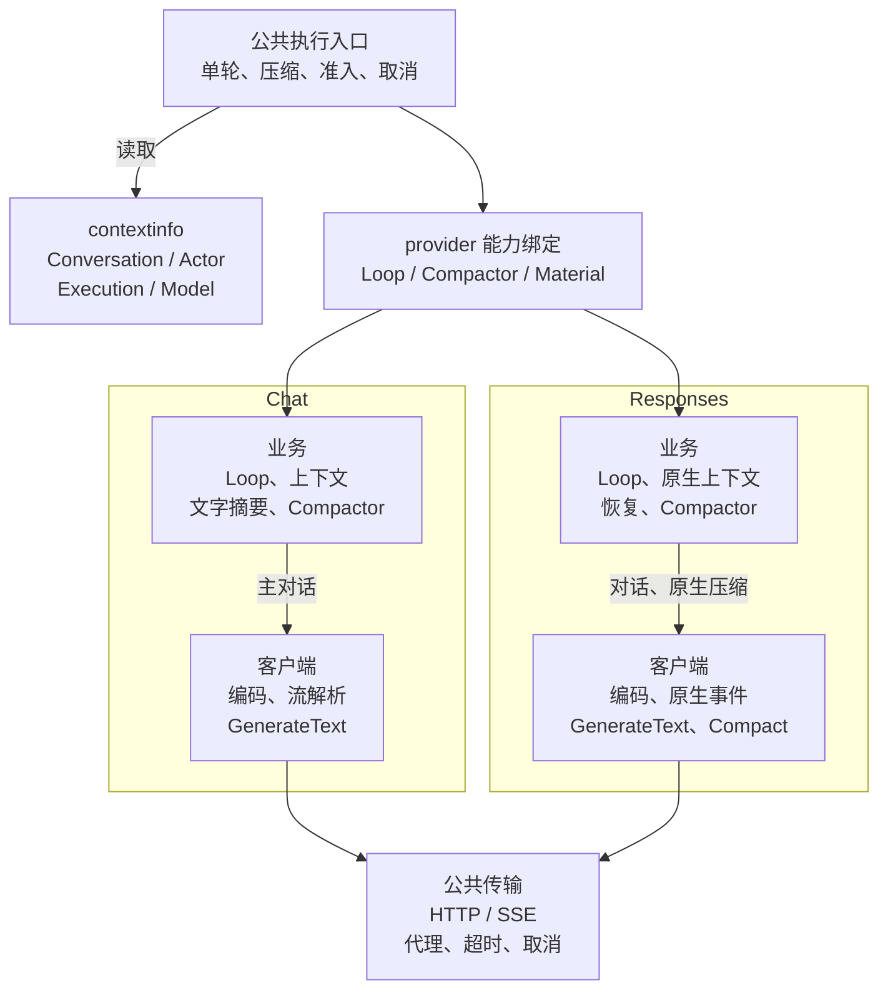
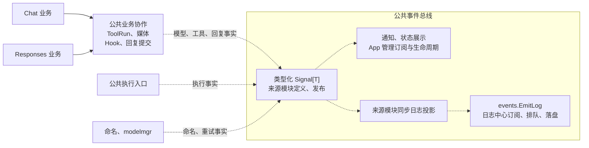

# ElBot 架构说明

本文说明模块职责、调用链和关键约束。代码入口见 [代码地图](code-map.md)。

## 定位方法

按 [代码地图的定位方法](code-map.md#定位方法) 选择 locator，再搜索本文件对应章节：

```bash
rg -n '^<!-- locator:tool-flow -->$' devdocs/architecture.md
```

按命中行号只读相关章节；需要具体文件入口时转到代码地图。

<!-- locator:startup -->
## 启动与装配

`main → launcher → app.Run / Runner → 平台与后台 runtime`。

- launcher 解析运行模式和参数；app 按 Environment、Foundation、Models、Platforms、Runtime、Integrations 阶段装配服务。
- app 创建共享 Session、Request、Turn、模型、上下文、工具、文件、发送、通知及命令服务。`Agent.New(ctx, cfg, deps)` 注入必需依赖、组合执行组件；命令注册和外部接线归 app。
- app 按 provider 配置创建客户端与注册表；Agent 校验并绑定协议业务能力、封闭注册表。Session／Hook 回调、订阅和补全接线成功后才开放平台入口；Cron 在平台启动后异步启动。
- `NewRunner(Dependencies)` 支持替换分组工厂。工厂失败时交回已取得资源的 Lifecycle，由 Runner 清理部分装配结果。
- 关闭先取消应用 context，再对日志中心及 App 订阅调用 `BeginClose`，停止接收并唤醒背压生产者；随后等待平台、Cron、订阅队列、追加确认、命名、Hook 和 Skill 加载退出，最后关闭 SQLite 与日志。日志中心的 `Close(ctx)` 使用同一退出预算。
- 全部退出共享 30 秒预算。超时后保留仍在运行任务的依赖，交给进程退出；重复停止等待同一完成结果，关闭后不能重启调度。正常取消及预算耗尽不算应用失败，真实错误继续返回。

<!-- locator:contextinfo -->
## 公共上下文事实

`contextinfo` 唯一定义四组事实，getter 返回快照和存在标记；缺失不补全局默认值。

| 分组 | 内容与来源 |
|---|---|
| Conversation | 平台、平台会话、发送者、消息／回复 ID 与平台私有扩展，由入口提供 |
| Actor | ElBot 身份、角色及平台群角色，由 security 解析 |
| Execution | Session／当前、父、根 Request／Run／Attempt ID，由对应服务建立关联时提供 |
| Model | 固定 Selection 与 provider 绑定确定的 provider、model、protocol |

- 平台会话 ID 与 ElBot Session ID 分别表达。角色事实不授予权限，执行 ID 不替代 binding／attempt 有效性校验；公共包不持有凭据、配置、服务或原生载荷。
- `MessageContext` 安装公共 Conversation，私有 context 保存正文与 Sender，读取时重建投影。`PlatformData` 由平台提供不可变快照，公共层不解释或序列化。
- 前台接管替换 Conversation、Actor 和平台来源，清除新来源缺失的事实，并按新选择更新 Model；执行取消链保持不变。
- 远程 CLI 默认回复固定原连接，断开即失败；显式用户／管理员目标按多连接规则发送。

<!-- locator:signal -->
## 信号与订阅

来源模块拥有内部事实的实例 `Signal[T]` 及事件类型。Agent、Session 和 Model Manager 自行连接同步日志投影，并在关闭时断开；App 只管理通知和状态订阅。业务诊断和日志投影统一通过 `internal/events.EmitLog` 发布，日志中心自行订阅并持有分类队列；App 负责服务装配与生命周期，不转发日志或注入 Logger。具体见[信号与日志系统设计](signals-and-logging.md)。权限、可改写 Hook、Usage、工具记录和关键提交同步完成；信号发布观察事实。

- 发射时锁内取得订阅快照、锁外调用。断开不撤销已取得快照或已入队任务；一次性连接即使入队失败也被消耗。发布方固定可变数据及实际调用 context。
- 异步连接选择 FollowEmit（继承取消）或 FollowExecutor（只保留值）；关闭选择 CancelPending 或 Drain，底层取消优先。
- 串行队列默认容量 256、满时拒绝。日志使用 `WaitForCapacity + FollowExecutor + Drain`，按成功入队顺序写入；`BeginClose` 停止接收并唤醒等待者。入队不等于写入成功，拒绝、写入失败及未排空均有诊断，Done 表示 worker 实际退出。
- 日志写入预期很快、队列通常不会满，因此有意选择等待容量，并接受极端情况下业务等待且单次请求取消不能解除入队背压的取舍。
- Agent 运行与审计日志统一使用事件发布时的 `EventMeta`，固定 `session_id`、`run_id`、`attempt`、`request_id`、`root_request_id`，显式空值也不被消费 context 覆盖；异步消费不查询当前执行身份。
- `events.EmitLog` 在发布前固定时间、关联身份、错误诊断、延迟值及可变载荷。中心直接提交 runtime、audit、elnis 三个容量 256 的背压队列；解除请求取消的影响，按类别入队顺序排空。中心不替换全局信号实例，重复活动中心初始化被拒绝。
- 日志契约的 `ResultStatus` 与 `Level` 由来源独立指定，空结果不表示成功。`Error` 在发布前固定文本与通用诊断，不保留原始错误对象，中心不再解释错误链；正式字段优先于自由同名字段。当前公共契约与预载跳过记录已接入，其他业务来源的结果迁移见[任务清单](tasks.md#信号与日志系统整改)。
- 全部业务日志消费先脱敏再限长：摘要 256 个 Unicode 字符、详情 8 KiB、序列化记录 64 KiB；优先保留事件、模块及关联字段。runtime 详情仅在 DEBUG 配置下保留，audit／elnis 不受运行等级过滤。来源协议通过 `events.DiagnosticError` 提供上游失败详情，日志消费者不导入具体协议实现。
- 日志来源显式提供事件标识和摘要：客户端重试 WARN，最终失败 ERROR，主动取消不升级，权限／确认拒绝保留 WARN。命名失败的原始错误与兜底保存错误分别保留；上游失败审计不受运行级别影响。Hook 工具调用统一为 `hook_tool_call`，通过 `source` 和 `status` 区分来源及结果。
- Signal／Queue 的设施故障直接写 stderr，不依赖业务 Logger 或全局日志信号；真正的文件写入错误由队列检查并报告。中心关闭超时不关闭仍在使用的文件，也不释放活动中心名额，后续显式关闭可继续清理。
- Reader 按日期和文件写入位置倒序查询，每块读取 64 KiB，满足条数立即停止；每次读取与逐行处理检查取消。打开文件后固定本次读取大小，支持跨块行及 LF／CRLF；单行上限 16 MiB，读取失败或超限返回错误。摘要、详情、字段和原始记录均可筛选，查询不改变日志记录等级。
- 平台直接发布全局 `events.PlatformConnected`；Hook 协调模块与 Cron 通过自身 `StartPlatformEvents` 订阅，App 只在依赖装配完成后、平台启动前调用生命周期入口。事件仅携带平台名称，不缓存、不重放。
- Hook 与 Cron 各自按平台惰性创建容量 256、满时拒绝的独立队列；保留发射 context 的值、解除其取消影响。重复连接继续交给业务处理，Cron 自行维护补跑、互斥和投递状态。
- 消费者在 `BeginClose` 或应用取消时断开订阅、停止准入并取消待执行／在途任务；`Done` 表示实际退出。Agent 关闭同时等待平台 Hook 与 append 等待任务，Cron Service 关闭等待连接恢复；共享 30 秒预算耗尽时不释放活跃消费者仍在使用的依赖。

<!-- locator:config -->
## 配置与运行数据

配置查找顺序为 `--config → ELBOT_CONFIG_FILE → 平台配置目录`。配置和资产说明见 [配置文档](../docs/configuration.md)。

- `app.toml` 为主配置；同目录 `providers.toml` 定义客户端，`api_mode` 为 chat／response，缺省 chat。协议与 Session 的 chat／work／background 模式独立。
- `state.toml` 保存模型状态，命令修改后持久化，不自动重载外部修改；`tool_tags.toml` 保存工具标签。
- 用户资产位于配置目录的 `memories.toml`、`long_memory/`、`skills/` 和 `plugins/`。Hook 入口为 `plugins/hooks.toml`，插件配置为 `plugins/<plugin-id>/hook.toml`。
- `api_key_env` 优先读取系统环境，再读取配置目录 `.env`。
- 配置要求由所属模块声明，平台和 Hook 定义由 app 装配。`Load` 与 `Inspector` 共用读取、默认值、合并和校验；配置包不依赖具体业务模块。
- `/doctor` 仅超管可用，检查磁盘配置与内置资产并按文件报告；不读取密钥、不初始化文件、不启动 runtime。内容比较忽略 CR/LF，TOML 按原文解析。

<!-- locator:agent-chat -->
## Agent 对话链路

`平台输入 → 唤醒／入站 Hook → 命令或普通输入准备 → 执行准入 → 单轮准备 → 模型／工具循环 → 回复提交 → 跨轮收尾`。

| 层 | 职责 |
|---|---|
| Agent 入口组件 | messageHandler 分发输入；inputCoordinator 准备与预加载；backgroundRunner 准备后台身份和资源；commandExecutor 编排命令 |
| executionCoordinator | 前后台准入、attempt／Request、追加确认、pending 续跑、压缩交接和 Execution 完成 |
| dialogue.Runner | 登记前加载材料、登记后准备与保存用户输入、取得 Loop、收敛结果、提交回复 |
| chat／responses Loop | 各自的上下文、模型／工具循环、pending 和接管刷新 |
| dialogue 公共协作 | Prompt 来源、模型 Hook、ToolRun、消息事务和 ReplyCommitter |
| 根包协作组件 | 身份、确认、Hook、发送及状态记录 |

- Agent 为薄入口，组件按消费接口组合，不回调 Agent；构造参数直接注入所属消费者，共享层不保存协议私有状态。
- 准入先检查 provider 能力和模型兼容性，登记会话归属与 attempt。材料加载在 Request 登记前；Prompt、Hook、媒体归一及用户保存使用登记后的 Request context，检查取消。
- 每轮固定 Selection。普通 `/model` 不影响在途循环；前台接管刷新模型、工具和来源。解除后台要求的合成 user 提示位于请求末尾，不写入 system prompt 或展示历史。
- 工具阶段收到的输入进入 pending；下一次模型请求前合并，最终模型调用期间新收到的 pending 在本轮结束后自动开启下一轮。
- 用户／pending 和工具 transcript 通过共同提交口保存。每个实际调用与结果组成不可变 ToolPair，保存真实参数及媒体引用，同事务成功后才进入下一工具；没有结果不预写展示调用头。
- CommitGate 在本地事务内复核原 binding、活跃 Execution／attempt；Responses 同时比较预期 checkpoint 并提交原生状态。API 审计事实独立归档。
- 回复前再次刷新接管来源，发布 sending 状态，由 ReplyCommitter 提交；发送／落库顺序见[输出链路](#output)。
- 单轮结果保留 Outcome、Usage 和实际提交事实。协调器负责 Touch、用量、状态、压缩提示、pending、Execution 结果与命名，Runner 不结束跨轮 Execution。

<!-- locator:protocol-routing -->
## 协议路线与原生上下文

`llm/chatcompletions` 与 `llm/responses` 各自编码请求和消费原生流；`llm/httpclient` 提供传输。`agent/chat` 与 `agent/responses` 各自实现业务 Loop、Compactor 和材料准备，路线之间不互相导入。

- 公共 `llm.Client` 提供模型列表与独立 `GenerateText`；`Selection` 固定 Provider、Model、Client。命名和 Chat 摘要可使用任一文本客户端，独立文本不续接主会话或执行工具。
- `routes.Registry` 按 provider 绑定 Origin、Client、Loop、Compactor、Material，并独立登记源协议能力。查询由 dialogue／contextmgr／session 的窄接口完成；重复绑定、错误接线、封闭前查询及封闭后修改报错。
- 主对话按目标 provider 查询 Loop，压缩与分支按持久化源 Origin 查询能力；不从摘要目标或当前配置推断来源。缺失主对话能力在压缩、保存输入和模型请求前拒绝。
- `CanSwitch` 纯比较身份：Chat 可跨 Chat provider，同一 provider 节点的 Responses 可换模型；跨协议及涉及 Responses 的跨 provider 切换拒绝。命令提交选择前预检，执行及接管后的调用再次检查；永久接管在变更 metadata 前检查 work 模型。
- provider 节点名确定厂商身份，base_url 用于续链地址校验。注册表不持有执行状态或完整依赖容器。

### 主调用链

实线表示能力调用，协议业务与客户端各自分包。



### 公共协作与事件

虚线表示事实事件的发布与消费，各订阅者管理自己的连接和生命周期。



### Responses

展示消息用于业务观察，原生 items、推理材料和 checkpoint 用于真实续接；二者通过业务消息关联，不能互相替代。

- HTTP 请求前归档实际编码 JSON，显式请求 `reasoning.encrypted_content`，完整保存响应及未知 items。失败、取消、incomplete、提前 EOF 不推进 checkpoint；本地关键提交成功才消费输入与推进游标。
- 每次调用重新构建 instructions。默认沿 `previous_response_id` 只发送新增输入与工具输出；实际请求或响应表明 `store=false` 时，发送完整窗口且不带旧链 ID。主对话默认 store=true，独立文本固定 false。
- 目标 base_url 与来源 checkpoint／seed 的地址不同时重建窗口。明确旧链失效且尚无新内容时，以同厂商完整材料重试一次；网络、鉴权、含糊错误及部分流不触发恢复。复用已准备的输入、Hook 结果与 Selection，不重跑历史工具。缺推理、原生记录或素材时拒绝。
- schema 以 developer `additional_tools` 输入冻结，新增定义持久化；相同定义不重复，同名变化要求新会话。定义按历史位置回放，新增定义位于工具输出／用户输入之后、接管提示之前。
- 请求不发送顶层 tools；当前权限与 tool_choice 相交生成允许集合，响应调用再次校验。历史定义不恢复工具权限。只使用 ElBot function 工具。
- 工具调用集合、ID、名称和参数对 Hook 只读，改写在副作用前报错；Chat 允许参数改写。公共 Hook 通过注入策略校验，不识别协议。
- 工具副作用前保存原生响应和调用状态；结果与展示 ToolPair、原生输出及不可变历史快照同事务提交。历史快照不推进活动游标，Fork 只读当时结果；中断调用仅在原生材料补未执行／结果未知输出。
- 窗口由 seed 根、checkpoint 链和有序输入／输出重建，媒体重新解析并持有。首次调用失败后可复用完整待提交输入；格式版本、归档、定义或素材不一致时拒绝。

<!-- locator:commands -->
## 命令链路

`commandExecutor → Router → builtin 模块 → 领域服务`；Continuation 交给 inputCoordinator。参数帮助归 `command.Info.Help`，平台补全统一使用 completion，CLI 本地文件补全优先。

- 改变 Session 的命令声明 `SessionEffect`，执行器据此处理压缩与确认冲突；Session 规则由 Session 服务判断。
- 命令直接消费领域服务；手动压缩、运行查询和提交准入通过窄接口接入执行层。
- 普通用户的请求查询／停止限定当前 Session，超管可管理全局；取消前复核原 binding 与目标请求。参数补全使用解析后的 Actor。
- 列表展示状态按 Scope 隔离。用户命令说明见 [commands.md](../docs/commands.md)。

<!-- locator:request-turn -->
## Request、Turn 与状态

- Request 管活动请求树、父子关系、取消、超时和清理；LLM、工具、压缩与后台请求均登记，Hook／工具子请求保留根关联。
- Turn 管 Session 当前阶段、pending、确认和工具计数；Execution 管跨追加确认与压缩的 RunID、接管来源和一次性结果。attempt 防止迟到完成覆盖新执行，续接间隙的 pending 保持忙碌状态。
- Session、Execution、attempt、Request 分别承担归属、逻辑执行、尝试隔离和取消职责；接管、确认续跑与压缩交接保留这些独立边界，由组合场景测试约束状态转换。
- 风险确认先在锁内登记 attempt 与响应通道，再锁外发提示；响应、取消和迟到清理只操作固定等待对象。追加确认同样固定 AppendWait，等待及过期提示受应用生命周期管理。
- 状态同步校验归属、保存并发布单调版本。app 按 Session 和实际目标合并展示，远程 CLI 连接分别处理；终态不依赖后续事件唤醒，后台仅记录，绑定失效清理积压。

<!-- locator:tool-flow -->
## 工具调用链路

`路线 → ToolExecutor → ToolRun → Tool Runtime → 完成 Hook → ToolPair 提交 → 路线续跑`。

- ToolRun 使用 prepared Hook 后的真实参数，做命名解析、可见性、权限、风险确认和请求登记；Runtime 兜底检查 Actor／Policy。
- 完成 Hook 只处理已实际执行的结果；预检失败或拒绝不触发。结果以 Content／Segments 回灌模型，Data 仅供内部消费；输出意图交发送层。
- 工具发现状态成功提交后才更新调用快照；已完成工具动作不因状态保存失败回滚或重跑。
- Chat 的 tool message 只发文本，工具图片在同批 tool messages 后生成 user 多模态输入；图片标签和该派生消息不持久化。Responses 私有路线编码原生结果。
- 风险与确认供内部权限判断，不暴露给 LLM。文件调用在预检时固定目标、参数和 revision，执行前变化或绑定失效即拒绝。

<!-- locator:tool -->
## Tool Runtime、工具状态与文件

Runtime 管注册、schema、权限与执行器；ToolRun 管当前工具视图、路由及确认。`StateService` 唯一解释 Session 的工具缓存、发现、tag 和规则卡状态；`PreloadService` 只返回待提交状态与展示材料。

- `@tool`／`@skill`、发现及后台首轮预加载各自在一次提交中合并状态，失败保留原状态。耗时准备在准入锁外，提交前复核取消、原绑定、模式和压缩状态。
- `tool.Info.APITypes` 声明适用的 `llm.APIType`，空集合不限；有的工具如view_image仅限在Response api下使用则可声明。
- 前台 chat 不读写工具状态或注入 Skill／tag；请求和响应边界均过滤工具。后台只使用首轮授权缓存，续跑忽略新工具参数，禁止 discover_tool、workspace 和 ForegroundOnly 工具，Hook 不能扩大集合。
- `tool_list_names` 优先匹配工具／Skill，再匹配 tag；只有显式 tag 注入提示。Elnis 展开后的根工具仍受 allowed_tools 限制，任务正文不能扩大权限。
- discover_tool 激活对应 Skill wrapper；read_file／edit_file 的隐藏 rollback_file 依赖同样受权限及前台限制。schema 返回独立副本，Fork 不复制工具状态。
- shell 在收集时分别限制 stdout／stderr 为前 256 KiB，超出部分继续排空并丢弃，截断流尾部附说明；输出量不再决定收集缓冲区的增长。

`fileops.Service` 统一处理工具与命令编辑／撤销，workspace 提供路径契约，sandbox 限制后台路径。

- 文件提交锁顺序：目标路径 → Scope → SessionID → 备份状态。读取、diff 和准备在 Session 准入外；提交内复核绑定、取消、权限、解析目标和文件身份后写入。
- /stop、切换、删除和清理与提交互斥，先提交则完成操作，先取消／失效则拒绝。外部进程不参与这些锁。
- 撤销按 Scope／当前 Session／目标保存原始字节，仅成功写入后登记，内存上限 256 MiB／1024 条；执行时复核备份、路径和 revision。后台编辑共用目标锁但不登记前台备份。

### 媒体引用与清理

- 本体按 SHA-256 去重，`media_references` 是引用事实来源。消息、工具参数、Fork、Cron、Elnis、outbox 和输出关联通过事务维护引用，读取／发送另持临时引用。
- 工具通过确认后、实际执行前，递归关联最终 JSON 参数中完整有效的媒体 ID 到 Session；不扫描自由文本。执行失败保留引用，执行前拒绝不建立引用。
- 中心统一清洗名称和来源敏感信息；下载使用原始参数。图片入库前按大小／边长限制转白底 JPEG，ID 对应实际保存内容。LLM 请求副本按配置选择 base64／S3／hybrid，S3 按需初始化。
- Chat History 查询不下载；get_media 与 view_image 限当前平台／scope。媒体中心 `GetHistoryMediaBatch` 统一处理缓存、去重、下载预算及关联，同次最多尝试 5 个未缓存位置，失败计数，缓存不占次数，超限后仍返回缓存。主库按历史内部 ID 和媒体位置保存关联，历史删除后释放引用；跨库对账故障保守停止。
- 媒体中心负责导入与图片校验。结果使用稳定 MediaID 的 Segments，经原生 function_call_output 输出图片并随工具结果保存，不产生 delivery.Outputs。消息默认取首张图片，显式序号沿用全部媒体编号。
- Elnis 排队 URL 不下载，LLM 执行时物化，direct 实际发送才导入；outbox 保存稳定 ID。输出回执保留有序媒体位置，缓存期限使用 retention_days，非正值不缓存。
- 最后引用释放后保留 1 小时。清理认领与新增引用互斥；物理删除按远端 → 本地 → 记录执行，失败保留可重试状态。同媒体 ID 的导入／上传／删除互斥，不同 ID 可并行，每轮最多清理 4 个对象。
- 清理前检查缺失引用与悬空 owner，异常保守停止。应用启动在 worker／工具运行前依次清理媒体临时引用并调用 Elnis 恢复裁决，即使 Elnis 禁用也处理历史中断事件；任一步失败即停止启动，步骤可重复执行。事件状态与引用释放由事件仓储原子完成，持久化 outbox 保留；取消清理等待已启动任务退出。

<!-- locator:skill -->
## Skill

- AgentSkill 使用 `SKILL.md` 和可选 `ELBOT_SKILL.toml`；原生 EL／Go Skill 使用 `SKILL.elyph`，Go runner 可配编译产物。
- scanner 构建 catalog；discover_tool 展示详情或激活 wrapper。原生 Skill finalize 执行 lint、gofmt、build、reload。
- reload 串行验证完整候选，在 registry 单次替换后更新 catalog；失败保留活动快照。AgentSkill manifest 写入后 reload 失败则恢复原文件。
- 媒体只在执行阶段准备：shell 使用 media_inputs／ELBOT_MEDIA_N，Go 使用 payload.media_inputs，TOML 使用顶层 type=media 参数。stdout 媒体经 os.Root 校验和中心导入；普通文本 ID 不转换。
- shell 导出缓存复用 sandbox 清理；Go／TOML 使用 Skill cwd 下的调用专属目录，执行后释放临时文件与引用。

<!-- locator:hook -->
## Hook

普通 Manager 按事件点与优先级串行执行。`hook/control` 管列表和 reload；持久 Runtime 管进程、双向 RPC、waiting 和 SharedState。协议与配置见 [hooks.md](../docs/hooks.md)。

- 规则与持久配置先构建候选，校验通过才替换活动索引和 handler；进程异步启动，启动失败由 runtime 重启策略处理。
- exec 使用 hook.v2 单次 Pipe，默认直接启动 argv；超时／取消终止整棵进程树。进程环境在启动时固定，系统环境优先补 .env，PATH 同时用于解析 argv。
- Hook 来源保留显式值，再从公共事实补缺失；无聊天来源的事件保留空 Scope／Actor。唤起状态在入口计算一次，不因正文改写重新推断。
- llm.messages 深拷贝且只读；turn Hook 只改当前初始 user，request Hook 只改新 drain 的 pending。当前消息 segments 在请求前保存，工具完成 Hook 改写进入工具结果。
- Hook 返回控制字段和输出意图；waiting 消息在平台 Hook 后、命令与主模型前路由，/cancel 仅取消路由执行。
- Go Hook 使用宿主 MediaAPI，进程 Hook 使用媒体 RPC；临时引用随租约或 runtime 释放，外部 Hook 不接触媒体根目录、数据库或 S3 凭据。

<!-- locator:output -->
<!-- locator:notification -->
<a id="output"></a>
## 输出与发送

`业务输出意图 → delivery/dispatch.Router → 平台发送器 → Receipt`。notification 管通知规则与来源；最终对话提交归 ReplyCommitter。

- app 注入共享 Router 与通知服务。显式目标优先，否则使用原 Sender 或 Conversation；后台丢弃发送器有效，不从当前 Session 重建历史目标。
- 通知保留原来源、Sender、按需携带的 binding；取消或绑定失效拒绝发送。过程提示 FollowEmit，失败事实 FollowExecutor，均 CancelPending。无来源告警在本地交互 CLI 显示或 service 记日志。
- 发送前归一为 MediaID，临时解析发送副本。成功回执提供真实 platform／scope／message ID／output indexes；部分失败同时返回成功项和 error，关联失败记录但不重发。
- 最终 Hook 只改变展示文本，不改模型原文和历史正文。直接回复先发送及延迟 outputs 再落库；缓冲回复先落库再发送、关联和延迟 outputs。错误仍保留实际提交／回执，已成功内容不重发。
- 状态与发送观察事实在同步保存或实际提交后发布；通知失败不再触发通知。发送必须等待实际回执，入队不算成功。

<!-- locator:platform -->
## 平台适配

平台负责输入归一化、历史记录和输出落地，支持本地／远程 CLI、QQ OneBot、QQ Official、Telegram 与 headless。

- 原始有序 segments 写入 Chat History，去除敏感／临时来源；只在唤起或 waiting continuation 时物化媒体。Telegram／OneBot 按需解析，QQ Official 的 URL 直接导入中心。
- 引用按输出索引 → Chat History → 平台能力恢复媒体。相同 actor／platform／scope 的最后一条 assistant 触发 Resume，较早回复触发 Fork；即使 current 被清除也能恢复来源。
- OneBot 私聊直收或显式引用 forward 共用一层展开，嵌套及非图文使用占位；未引用群聊 forward 和历史保留占位。展开只进入 Context／DisplaySegments，原始媒体位置不变；去唤醒词或工具指令保持图文顺序。
- OneBot 纯文本超过 3000 个 Unicode 字符时合并 forward，只关联外层消息 ID，失败不退回分条。语音输出在其他不支持的平台使用文字 fallback。
- Telegram 流式分页失败返回已发页回执和错误，不重发整段。CLI 返回空回执。

<!-- locator:session -->
## Session 生命周期

- Session 唯一管理 current 与 Binding。切离后原 binding 永久失效，切回获得新 binding；删除失效全部相关绑定。输入、工具、确认及提交沿用原 binding。
- 准入锁顺序为 Scope → 排序 SessionID → 状态锁；模型、工具、Hook、发送及信号均在锁外。执行中禁止普通切离／删除，维护跳过忙碌项并复核归档、置顶及时间。
- BindingChanged 在状态及准入锁外发布，覆盖 current 变化；app 异步清理旧绑定，延迟不影响同步失效。一般字段更新不发布绑定变化。
- `llm_origin` 在首次主对话准入保存 protocol、provider、base_url，不含模型或凭据；保存失败拒绝调用。已有完整归属固定，压缩／Fork／后台副本继承。
- 后台准备不激活 current，复用拒绝已接管会话。后台仅所属用户同平台私聊与 CLI 管理入口可恢复；永久接管改为前台 Scope／work，保留历史与 workspace，运行中的 Execution 同步刷新来源但不重启在途请求或工具。
- Cron／Elnis 等待接管后 Execution 的真实结果，记录接管并停止 JSON 修正、自动报告与未开始补投递；不直接算作后台任务成功。
- Fork／后台复制在锁外准备源材料，提交时复核 binding、checkpoint、pending 与取消；新 Session、消息、seed 和素材引用原子保存后才激活。Responses 使用分叉时的不可变 checkpoint，工具调用头边界包含对应结果、排除后续结果，seed 独立持有完整窗口；不重跑历史工具。后台副本不激活前台，也不继承执行或工具状态。
- 命名受应用生命周期管理，Turn 结束不取消；关闭拒绝新任务并等待实际退出，取消后不写标题或 fallback。命名事件保留真实模型，包括 fallback。
- TTL 和 /new 只清除 current，下一条输入再建记录；恢复刷新活跃时间。模式、分页选择及权限按 Scope 隔离。

<!-- locator:llm -->
## 模型服务与客户端

- `modelmgr.Service` 唯一持有模式／槽位、compact／naming 选择、provider 客户端和模型目录；不依赖 Agent／Session。后台默认 work，Elnis 可用 elwisp1/2/3，Cron 可指定任务模型。
- 模型目录并行查询各 provider，合并配置项，编号在筛选前分配；目录及选择返回独立快照。
- 切换串行构建候选，原子保存 state.toml 后才发布内存状态，失败保留旧选择；保存时不阻塞读取旧快照。命名和摘要固定各自的选择与 fallback，Prepared Hook 不改模型身份。
- httpclient 负责 HTTP、代理、可取消初始交换重试、SSE 分帧及超时；鉴权、编解码及终态归客户端，断流不重放请求。Extra 只能补字段，覆盖或重名发送前拒绝。
- 共享客户端发布 ModelRetrying，对话／压缩／命名使用同一通知接线；客户端配置启动后固定。

<!-- locator:context -->
## 上下文与压缩

contextmgr 管历史、窗口、用量、阈值及压缩分派；协议 Compactor 准备结果，executionCoordinator 管 Request／Turn 与交接，Session 保存并激活新会话。

- 手动和自动压缩共用 compact_enabled／compact_trigger_ratio 及当前模型窗口。压缩中拒绝输入、允许停止；交接复核取消、原绑定、接管和源 checkpoint，先保存新 Session，再更新前台 current。后台保持无 current，继承 workspace 与命名信息，清除旧用量。
- Chat 用独立文字摘要模型或对话 fallback。新 Session 暂存文字 seed，首条输入保存为“摘要＋历史用户原话＋当前输入”后消费 seed。
- Responses 固定当前模型，完整窗口末尾加 compaction_trigger，使用普通 Responses 流，store=false、tool_choice=none、不带旧链 ID 或正文格式要求。终态必须含唯一非空加密 compaction，新 seed 仅保存该项与素材引用，不拼历史原话或续旧链；首个本地 checkpoint 成功才消费 seed，根材料保留供恢复。
- 原生压缩不支持、材料缺失或提交失败时报错，不降为文字摘要，也不切换当前会话。自动压缩交接后继续已接收输入，手动压缩不自动聊天。
- Soul、记忆、工具和 tag 提示由共同 Prompt 来源组合；Chat 每轮构建一次 system message，不入历史。Usage 按 Session 返回副本并更新所属 metadata，保存失败仍保留已观测值。

<!-- locator:storage -->
## Storage 与 SQLite

- storage 定义领域模型和 repository 契约，SQLite 实现消息、Session、聊天历史、工具记录、Cron、Elnis 和原生状态事务。
- 主库使用单连接，工具状态随整份 Session metadata 在事务内合并更新，以保持事务与状态合并简单可靠；实测出现连接等待或编码瓶颈后再调整存储与并发方式。
- Session 字段修改使用 `Mutate` 在短事务读取最新行，只改负责字段；回调不做外部 I/O 或嵌套仓储操作。RawMessage 保留未知 metadata 和数值精度，损坏数据拒绝读写。
- 多模态 segments 为结构来源，content 为文本投影；非空 segments 优先。ToolPair 保存调用／结果关联，复制消息时重映射 ID。
- `native_exchanges`、`native_inputs`、`native_calls`、`native_checkpoints`、`native_seeds` 保存原生记录，Session metadata 只保存归属、版本和引用。关键提交比较旧 checkpoint，材料事务同时保存 Session、历史及媒体引用；查询保留平台隔离、归档与 Fork 范围。

<!-- locator:elnis -->
## Elnis / Elvena / Elwisp

Elnis 接收并分发事件，Elvena 定义公共协议，Elwisp 提供外部事件和工具。Elnis 作为 app runtime 复用后台执行与发送服务，不充当聊天平台或管理外部监听器。

- 未形成持久化报告的中断执行保守标记失败，避免重放已产生的工具副作用；持久化报告恢复投递，接受部分发送成功或回执未落库时的重复投递。

内部链路、去重和投递约束见 [Elnis 架构](elnis-elwisp.md)；配置与协议示例见 [使用文档](../docs/elnis-usage.md)。

<!-- locator:cron -->
## Cron 与后台任务

Cron 管持久化任务、调度与运行；maintenance 集中注册维护任务。Cron 与 Elnis 共用 Agent 后台执行、sandbox 和 JSON 结果能力。

- 每次实际调度新建后台 Session，同轮 JSON 格式重试复用 Session、首轮工具状态和固定模型。后台 shell 非 critical 风险自动确认，critical 返回提醒。
- 任务专用 provider／model 成对校验；省略更新保留、同时清空回到 work，不修改全局选择。
- once 的配置与 Delivery 分列保存，按仍启用的 RunID／报告 Session 条件更新。TaskCompleted 记录任务结论，ReportReady 表示报告可复用；全部投递完成才禁用。
- 平台连接恢复与正常发送共用逐目标／逐 output 状态；已有报告只补发，不重跑 LLM。补发读取最新配置，由连接触发；附件失败同轮降级文字，失败后等下次连接。
- 同任务投递互斥且可取消。报告落库前可能重新执行，发送成功但回执落库前崩溃可能重复投递；不承诺 exactly-once。
