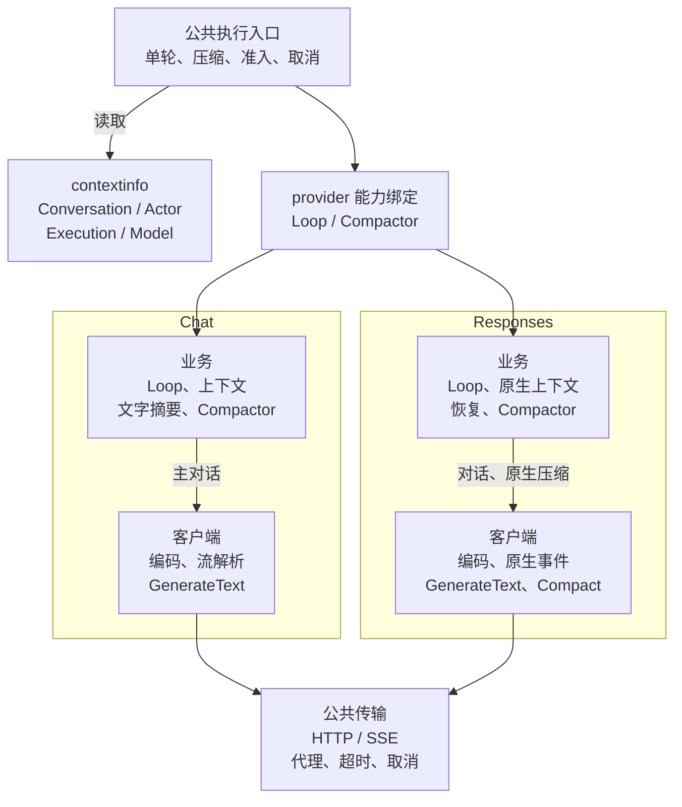
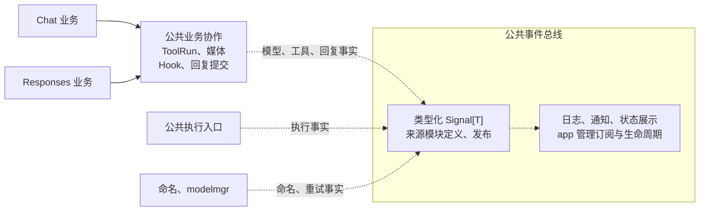

# 核心职责重构方案

本文只维护后续目标与未决问题。进度见[任务清单](tasks.md#core-refactor)，当前实现与文件入口见 [architecture.md](architecture.md) 和 [code-map.md](code-map.md)。
注：旧代码与已确认的目标设计不符时，先询问用户是否同时改造或优化；不得擅自扩大改动、改变设计或强行兼容旧代码。已获授权的改造按确认结论执行。

<!-- locator:core-refactor -->
<a id="phase-16"></a>
<!-- locator:protocol-routing -->
## 阶段 16：公共执行与独立协议路线

16.1 的公共单轮与 Chat 路线、16.2 的协议客户端已验收。当前仍使用 `chatinfo`、`Selection.Protocol` 及按协议登记的 Route；16.2a 的公共信息迁移与 provider 绑定尚未实施，Responses 业务、原生持久化及恢复按 16.3／16.4 接入。

### 职责与依赖

| 领域 | 归属 | 职责 |
|---|---|---|
| 公共信息 | `contextinfo`（暂定名） | 按领域提供只读事实，由现有 chatinfo 扩展 |
| 公共执行 | Agent 执行协调、`agent/dialogue` | 准入、Request、单轮准备、工具协作、结果与回复提交 |
| 协议业务 | `agent/chat`、`agent/responses` | 各自的 loop、上下文、工具结果组织和 Compactor |
| 协议客户端 | `llm/chatcompletions`、`llm/responses` | 原生请求、流事件、终态、独立文本及协议接口 |
| 公共传输 | `llm/httpclient` | HTTP、代理、初始交换重试、取消、SSE 分帧及超时 |
| 能力绑定 | `agent/routes` | provider 的 Loop／Compactor 与稳定身份登记、封闭和查询 |
| 模型选择 | `modelmgr` | 全局选择、客户端快照、目录及纯兼容判断 |
| 会话与上下文 | `session`、`contextmgr`、`storage` | 会话归属、用量与压缩分派、原生记录及关键提交 |

公共层依赖消费方所需接口，协议业务与客户端分别分包，两条路线互不导入，也不持有 Agent 或绑定 Agent 的回调。客户端不依赖 Agent 业务层；公共信息包不反向依赖业务服务。新协议通过实现、装配和登记接入，共享执行流程不增加协议专用分支或第二套执行状态。

协议私有请求、Chat chunks、Responses items 和推理材料留在各自实现中。只共享语义一致的能力，不把 Responses 转成 Chat chunks，也不建立万能请求、事件或依赖容器。鉴权与 API 编解码归客户端，传输层不固定厂商鉴权或私有事件格式。

### 公共单轮边界

```text
输入 → 执行协调器：固定选择、准入与兼容检查
→ 必要时压缩并交接
→ Runner.PrepareTurn：Request 登记前加载材料
→ 登记 Request → Runner.RunTurn：准备并保存输入
→ 按 provider 查询 Loop → 原生模型／工具循环
→ LoopResult → ReplyCommitter → 跨轮收尾
```

- 保留准备、用户输入保存、取消、父请求关联及实际提交的边界。公共结果收敛 Outcome、Usage 和提交材料；回复提交保留直接／缓冲发送、部分成功、实际回执及已成功不重发的规则。
- 权限、风险确认、参数 Hook、媒体持有、文件预检及工具记录继续由公共协作与 ToolRun 处理；路线组织实际调用参数、ID 和原生结果。Hook 消费业务投影，展示改写与模型原文分别保存用途。
- 普通 `/model` 不改变在途选择。前台接管刷新来源、身份和准备材料，保留原请求取消；下一次模型调用先检查兼容性，不在 loop 内隐式换协议或丢弃状态。

<a id="phase-16-2a"></a>
### 16.2a：公共信息与 provider 绑定

app 按 provider.api_mode 创建客户端和共享服务，Agent 装配业务能力。启动时按 provider 登记 Loop／Compactor 及稳定身份，校验客户端满足所需私有接口，统一封闭后开放入口。重复绑定、封闭前查询、封闭后修改及能力不匹配明确报错；同路线可复用无 provider 状态的业务组件。

运行快照为 `Selection{Provider, Model, Client}`，移除 Selection.Protocol 和 Client.Protocol()。dialogue／contextmgr 分别按目标 provider／源会话归属查询所需能力；独立文本直接使用 Client.GenerateText。未接入主对话的 provider 仍可用于独立文本，主对话能力缺失时在压缩、保存输入和模型请求前拒绝。

`api_mode="chat"/"response"` 与 Session 的 chat/work/background 模式独立；省略 api_mode 为 chat。会话持久化身份独立保存，不能用客户端对象或当前配置代替原生归属。

#### 公共信息

`contextinfo` 按四个领域分组，不要求所有入口同时具备全部信息：

| 分组 | 公共事实 | 来源与生成时机 |
|---|---|---|
| Conversation | 平台、平台会话、发送者、消息与回复标识 | 平台入口；由现有 MessageContext／chatinfo.Info 衔接 |
| Actor | ElBot 用户身份、普通用户／超管角色 | security 解析后提供，平台群角色与 ElBot 角色分别表达 |
| Execution | Session、Request、执行关联标识 | 现有服务建立关联后提供，保留实际 ID 语义 |
| Model | 主对话 provider、模型、Chat／Responses 协议 | 固定选择与 provider 绑定描述，选择确定后提供 |

各领域的公共事实以 contextinfo 为唯一来源，现有 chatinfo、security 等模块的事实定义与存取随之改造，不保留并行副本。实际消费者从公共入口读取对应快照；信息缺失明确表达，不查询全局“当前用户／模型”补齐，也不猜成 Chat 或普通用户。公共包不携带凭据、配置、服务能力或原生载荷。

角色事实不授予权限；权限判断仍归 security／ToolRun。Execution 不复制活动状态，取消、Binding.Valid、attempt 有效性仍归现有服务。`request.WithTurnID` 当前携带主 Request ID，不能解释成另一个 Turn ID。

迁移接入现有 ExecutionView.Context 的前台刷新边界：Conversation 与 Actor 一起更新，整份来源上下文替换，原连接回复、平台私有扩展和执行取消语义保持。私有扩展由平台维护不可变快照，公共层不解释或序列化；会话原生归属及 checkpoint 留在 Session／原生存储。

#### 独立文本与公共事件

命名和 Chat 文字摘要使用 GenerateText，可选择任一已配置客户端；Responses 独立文本不续接主会话链、不执行工具。摘要及 Usage 同步返回，不改变主会话归属，也不为命名／摘要增加公共协议字段。若观察消费者需要调用身份，在相应事件中携带实际调用快照，包含回退后的真实目标。

公共事件总线沿用 `Signal[T]`：来源模块拥有事件类型与信号实例，app 的 signalBindings 拥有订阅、队列和关闭生命周期。继续使用 Agent、命名、重试等已有信号，不新增全局 Bus 或 Publish(any) 入口。

事件保留发布时的 EventMeta、来源及实际调用 context；不在消费时读取全局选择补全历史事实。背压、FollowEmit／FollowExecutor、Drain／CancelPending 和共享关闭预算沿用[当前信号约定](architecture.md#信号与订阅)。协议流事件先由私有实现处理，公共总线发布业务事实；权限、可改写 Hook、Usage 和关键提交仍同步完成。

#### 主调用链

框表示协议职责，实线表示能力调用。Responses 业务和 Compact 为后续目标，尚未接入。



#### 公共协作与事件

本图引用主图业务节点；虚线表示事件发布与消费。



### 16.3：Responses 原生上下文

展示消息用于历史与业务观察，原生记录保存真实请求／响应、身份、items 和推理材料，二者按业务消息／checkpoint 关联。Session 只保存归属与 checkpoint 引用，持续增长的原生历史归原生存储。

- 正常沿 previous_response_id 续接，每次重新发送当前 instructions，只追加本次输入、pending 和工具结果，见[官方迁移说明](https://developers.openai.com/api/docs/guides/migrate-to-responses)。
- API 完整终态可登记响应事实；可续接 checkpoint 仅在本地关键提交成功后推进，保留回复关联、事务及 binding／attempt 校验，阻止迟到写入。流 token 不逐个写入会话状态。
- 原样保存返回的推理、调用和未知 items，包括不可读材料；摘要不能替代完整推理状态。媒体保留本地素材关联，临时 URL 或失效服务端引用不能证明材料完整，见[原生回放说明](https://developers.openai.com/api/docs/guides/reasoning)。
- 失败、取消、incomplete 或提前 EOF 不作为正常完整终态。恢复回放已保存的调用和结果，不重新执行历史工具或重复已成功发送。
- 工具参数 Hook 改写后，后续原生上下文必须与实际参数一致；不能保全时在工具执行前拒绝。服务端已有 response 不假定可原位修改，分支／回放方式须先讨论验证。只接入 ElBot function 工具，不接入服务端内置工具。

### 16.4：模型兼容、恢复、压缩与 fork

modelmgr.CanSwitch 只比较身份，不查询或修改 Session；源身份来自会话记录，目标身份来自 provider 绑定。命令入口先预检再修改全局选择，请求入口再次检查，且检查先于自动压缩与 API 调用。

| 来源与目标 | 行为 |
|---|---|
| 无历史的新会话 | 选择已配置起始协议／厂商，并在接入时登记归属 |
| Chat → Chat | 允许跨厂商，保留既有工具语义 |
| 同厂商 Responses → Responses | 允许切模型，保留原生上下文；实际接口不兼容时报错 |
| 跨厂商且任一方为 Responses | 拒绝，提示新建会话或切回兼容模型 |
| 全局默认或 provider 配置使旧会话不兼容 | 执行前拒绝，不隐式沿用旧模型、迁移历史或重解释原生记录 |

服务端链失效时，仅凭同厂商完整原生材料恢复；缺少推理、有效 checkpoint 或素材则拒绝。稳定归属不能只由 provider 别名推断，具体身份字段列入实施前讨论。

公共压缩入口按源会话归属取得 Compactor，私有实现返回统一统计及带协议身份的 seed。公共层保存和交接，Session 负责创建与激活新会话；workspace、命名代数和永久接管等继承语义沿用现状。

- Chat 保留文字摘要与现有新 Session seed。Responses 使用同厂商原生压缩，完整保留后续窗口、不可读压缩项及必要 items，以新会话 seed 开始，不接回旧链，见[原生压缩说明](https://developers.openai.com/api/docs/guides/compaction)。
- 不支持原生压缩、材料不完整或提交失败时明确报错，不退成文字摘要、不改变未成功交接的当前会话。
- Responses fork 使用指定业务回复关联的完整 checkpoint，继承协议／厂商归属；没有完整 checkpoint 则拒绝，不能用源会话最新 response ID 替代任意历史位置。Chat 保留现有 fork 行为。

### 实施前未决问题

相应代码任务开始前讨论并验证；出现新的选择或歧义先与用户确认，不由实施者补成既定约定。

1. 原生路线新增消费接口及其与已实现公共单轮、构造和事件边界的衔接。
2. 归属身份、Exchange／Checkpoint／seed 字段、媒体关联，以及回复、工具阶段、新 Session 与 checkpoint 的事务边界；沿用现有 binding／attempt。
3. 完整恢复材料与服务端引用的验证；参数 Hook 改写时如何保全推理状态，何时必须拒绝执行。
4. 原生压缩能力检测、阈值、新 seed 与旧链分离，以及可建立 fork checkpoint 的业务位置。

### 验收与Review

按 16.2a → 16.3 → 16.4 → 16.5 接入；每批保持可编译、默认 Chat 可用，未接入能力明确拒绝。

| 验证类别 | 必须覆盖 |
|---|---|
| 信息与装配 | 四组事实及缺失、provider 绑定、能力错误、依赖方向、真实 app 接线 |
| 执行与工具 | pending、停止、确认、接管、媒体、参数 Hook 一致、固定选择及权限 |
| 原生状态 | 流终态、完整／缺失材料、迟到写入、不重复执行、压缩交接及历史 fork |
| 提交与生命周期 | 部分成功、实际回执、存储失败、事件快照、背压、启动失败及共享关闭预算 |
| 架构层面 | 职责是否清晰，边界是否清楚 |
| 代码层面 | 是否残留旧代码，是否使用新架构，是否有不统一的入口或者自造方法 |

相关包测试通过后运行全量测试及受影响包 race，保留启动／关闭回归。代码落地后更新当前架构和代码地图，再勾选任务；其他验证与文档规则见 [AGENTS.md](../AGENTS.md)。
