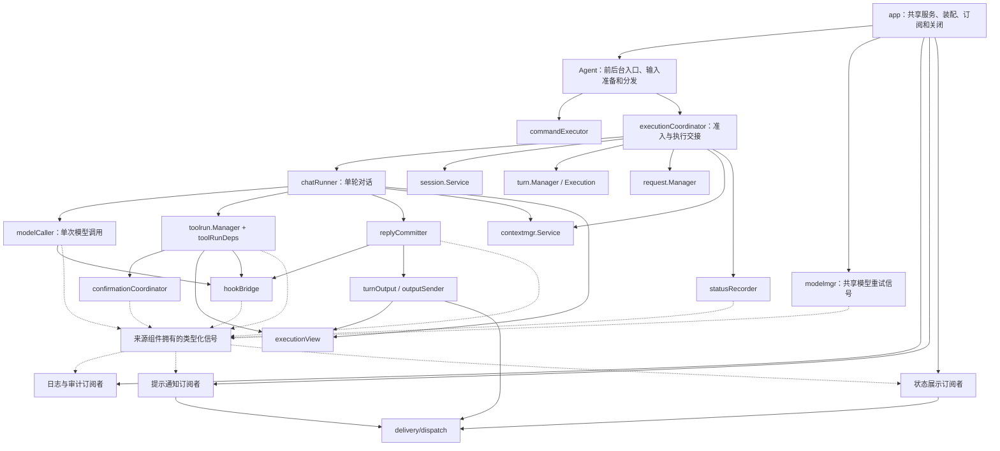

# 核心职责重构方案

本文记录已确认的目标设计、实施顺序和验收要求。方案落盘不代表代码已经完成重构；实施进度统一在 [任务清单](tasks.md#core-refactor) 勾选，已落地架构和代码入口分别见 [architecture.md](architecture.md) 与 [code-map.md](code-map.md)。

<!-- locator:core-refactor -->
## 执行约束

**执行过程中遇到多种实现方式、存在歧义，或需要改变已确认约定的地方，不能自作主张，必须先与用户讨论并得到明确结论，再继续相关改动。** 不得把自己的偏好写成已经确认的决定。讨论结论同步到本文及受影响的任务项；不依赖该决定的工作可以继续。

本文明确的职责、包名与行为约定作为实施依据。尚未确定的技术细节集中列在“实施前需讨论的细节”，应在对应阶段开始前讨论，不能用默认猜测补齐。

每个阶段均完成实际接入、相关验证和开发文档同步后再勾选；保留项目可编译、可运行的状态，不把全部接线推迟到最后。

**开发文档若有过时的或者冲突的，直接删除或修改为新版，以新的代码为准**。

## 目标与范围

重构范围为 Agent、命令、工具、Session、模型、上下文、发送通知及 app 装配。目标是让业务模块拥有自己的状态和规则，Agent 作为应用级入口，通过职责明确的内部组件完成执行编排。阶段 1–8 的实施与 Review 记录保留；阶段 9–15 的目标设计和验收要求见后文，实际完成情况以任务清单为准。

- Agent 负责消息分流、前后台入口和内部组件装配；执行交接、单轮对话、模型调用、确认及回复提交分别由内部组件负责，不通过持有整个 Agent 访问能力。
- 命令和工具入口负责参数、协议与结果展示，具体能力交给对应服务。
- 公共信息包描述来源、发送者身份和消息／回复 ID，并允许必要的平台扩展；平台主动提供标准信息。
- Session 管理持久化会话和当前绑定；Request／Turn 管理本次执行。
- 信号传递事件对象，通知管理器消费通知意图，发送层执行平台交付。
- app 创建共享组件、注入依赖、连接信号并管理生命周期。

本轮以保留现有用户行为、权限边界、配置语义和持久化数据为基线。复用现有接口与实现，不为未来能力引入投机性代码，不另建可靠消息中间件。通知开关、模板编辑、免打扰等新用户功能不属于本轮。

## 包与文件归属

下表路径均相对于 `internal/`。表中新增文件按职责组织；现有职责文件继续复用。

| 包／目录 | 文件落点 | 职责与迁移来源 |
|---|---|---|
| `chatinfo/` | `source.go`、`identity.go`、`context.go` | 公共平台／会话来源、发送者身份、消息／回复 ID、平台扩展和 context 存取 |
| `signal/` | `signal.go`、`connection.go`、`executor.go`、`queue.go` | 泛型信号、连接句柄、执行器契约、串行队列；不导入业务模块 |
| `notification/` | `manager.go` | 通知意图、原来源与 Binding 捕获及通知策略；通过发送接口交付 |
| `notification/rules/` | `platform.go`、`hook.go`、`model.go`、`execution.go` | 将相关业务事件转换为通知，维护通知文案和触发规则 |
| `delivery/` | 保留现有类型和 Manager | 平台无关输出、目标、回执、校验和发送契约 |
| `delivery/dispatch/` | `router.go`、`media.go` | 接收 Agent 的平台路由、媒体发送准备及媒体回执关联职责 |
| `session/` | `binding.go`、`signals.go`、`workspace.go`、`background.go` | 当前绑定、生命周期信号、workspace 持久化适配和后台会话准备；保留已有创建、恢复、命名和查询职责 |
| `modelmgr/` | `service.go`、`selection.go`、`catalog.go`、`state.go` | 从 Agent 抽出模型选择、客户端缓存、模型列表和运行状态读写 |
| `contextmgr/` | 增加 `service.go`、`state.go`，复用现有职责文件 | 收拢上下文加载、窗口、用量和压缩状态；执行调度保留在 Agent |
| `workspace/` | `workspace.go`、`resolve.go` | 从 Tool 提取已有 workspace 契约和路径解析，统一入口组合 sandbox 限制 |
| `sandbox/` | `sandbox.go` | 从 Tool 提取后台路径限制和沙箱上下文；复用原有规则 |
| `fileops/` | `service.go`、`rollback.go`，迁入现有文件操作文件 | 统一底层文件操作和命令／工具共享的编辑撤销服务 |
| `command/builtin/` | 沿用现有命令文件名 | 接收 `agent/commands`；具体命令依赖领域服务 |
| `toolrun/` | `state.go`、`discovery.go`、`schema.go`、`cache.go`、`preload.go`、`tags.go` | StateService 统一持久化；独立 PreloadService 管理前后台预加载和标签查询，Manager 管理工具调用 |
| `platform/` | 增加 `signals.go`，调整各 adapter | 提供公共来源信息和连接信号，保留平台协议与连接细节 |
| `app/` | `services.go`、`signals.go`，调整现有装配文件 | 构建共享服务、连接信号、配置执行器和关闭顺序 |
| `agent/` | 保留消息、命令及前后台入口；阶段 9–15 按后文文件树收拢执行、对话、确认与输出组件 | 内部组件只注入必要依赖；Agent 不再集中拥有组件状态，观察逻辑通过类型化信号接入 |

### 依赖边界

- `chatinfo` 和 `signal` 是基础契约，不依赖 Agent、Session、通知或具体平台实现。
- 具体事件类型由来源模块定义，例如 `session/signals.go`、`platform/signals.go`；其他模块需要新增信号时也遵守这一归属。
- `notification/rules` 可以组合来源模块与通知管理器；来源模块不反向导入通知规则。app 负责连接，业务文案不写进 app。
- `delivery/dispatch` 组合 `delivery`、媒体中心和平台发送能力。媒体中心已经依赖 `delivery`，不能把依赖媒体中心的发送实现直接放回根 `delivery` 包形成循环引用。
- Agent、通知、Cron 和 Hook 通过发送接口复用同一发送能力；通知管理器不再实现第二套媒体处理和平台 sender。
- 文件操作统一在 `fileops` 内按文件分工。基础字节／文本操作不读取当前 Session，共享服务入口接收调用所需的绑定信息。
- 命令依赖服务接口，模型等领域类型由所属服务提供；领域服务不依赖命令包的展示类型。

## 公共信息与事件对象

公共来源信息包含平台标识、ScopeID、平台会话类型及会话 ID；发送者身份包含平台用户 ID、内部身份关联和昵称、群名片等显示信息。Info 同时拥有 PlatformMessageID、ReplyToMessageID、ReplyToSenderID 和 PlatformData any。平台会话标识与 ElBot 持久化 Session ID 是不同概念。

公共包不承载消息正文、配置、workspace、权限判定结果、发送器或 Session 生命周期。权限仍由安全策略处理。聊天历史工具和 Prompt 等实际消费者按需读取公共信息，普通工具不被要求依赖它。

平台在消息进入系统时构造来源与身份对象，随该条消息传递。异步任务保存触发它的那份来源信息；禁止保存全局“当前用户”，也不能在发送时重新查询当前会话来决定旧通知的目标。

信号使用 `Signal[T]` 传递各模块自己的事件对象。对象可以包含公共来源信息、结果或错误，以及确有需要的 Session 绑定标识。无需拆开重拼公共信息，也不设计包含所有业务字段的万能事件或另一套通知上下文。

事件发布后，其用于消费的数据保持不可变：不可变对象可以共享引用；可变的 map、slice 或结构状态需由发布者形成稳定快照。信号内核不负责猜测并深拷贝任意对象。绑定有效性等有意保留的动态能力由所属模块控制，订阅者只能按公开契约查询。

平台自行定义 `PlatformData` 的私有类型，优先只放公共字段无法表达的必要信息，不重复公共字段。生产者保证发布后的稳定快照；公共层不解释、不序列化、不通用深拷贝 any。远程 CLI 的原连接引用放在扩展中，QQ 官方的原消息 ID 使用公共字段，事件信息留在扩展。默认回复不能扩大为该用户所有连接广播，原连接断开后返回失败。

OneBot／Telegram 从公共会话信息恢复默认目标，QQ 官方区分默认原消息回复与显式主动发送。Prompt 直接消费公共 Info，不保留 ConversationMeta 转换层，也不把平台扩展写入 Prompt。

## 信号与执行器

### 已确认的行为

| 项目 | 约定 |
|---|---|
| 连接与发射 | 提供连接、发射和显式断开能力；每个信号有明确的事件类型 |
| 普通连接 | 在发射调用中直接执行，适用于已确认快速、无 I/O 的回调 |
| 延迟执行 | 连接时指定执行器；信号本身不为每次调用创建 goroutine |
| 回调锁边界 | 锁内取得连接快照，锁外执行回调或提交执行器；业务模块也不得持有自己的状态锁执行外部回调 |
| 一次性订阅 | 需要时使用一次性连接；在执行回调前断开，避免递归发射重复触发 |
| 顺序与隔离 | 同一串行执行器按入队顺序执行；不同执行器独立，不承诺跨执行器的完成顺序 |
| 容量 | 队列有上限，默认满时明确反馈入队失败；阶段 13 为日志显式增加等待容量的背压策略，不能无界积压、丢弃日志或绕过队列写入 |
| 错误 | 一个订阅者执行失败不妨碍其他订阅者；执行错误记录到日志，入队成功不表示回调或消息发送成功 |
| 断开 | 停止后续发射中的投递；已取得的发射快照与已入队任务不自动撤销，取消由执行器／业务生命周期处理 |
| 关闭 | 停止新事件来源并断开订阅，及时关闭入队、解除背压等待，再等待生产者退出并限时处理队列；超时取消待执行任务并请求在途任务协作退出 |

耗时消费者分别使用执行器，包括通知发送、Cron 补跑、外部 Hook 和可能等待文件操作锁的撤销清理。Go 使用显式连接句柄及关闭流程，不依赖 GC 推断订阅对象的生命周期。

信号不承担命令调用、可改写结果的 Hook 流水线、事务提交或可靠消息投递。Cron／Elnis 的持久化状态、重试和回执关联继续由原有业务负责。关键状态必须先由所属服务完成，再发信号通知其他模块。

关闭流程接入现有 Runner 生命周期；当前总关闭预算为 30 秒，各组件共享剩余预算，不能为每个执行器重新延长总时限。使用发送器、存储和日志的回调实际结束后，才释放对应资源。预算到期仍有回调在途时停止等待，跳过其依赖的显式释放，由进程退出结束；不增加后台收尾链。正常取消和预算耗尽不作为应用失败。

### 参考Godot

- Godot 信号属于对象，发射时可以携带参数，连接保存回调和执行选项。[Signal 文档](https://docs.godotengine.org/en/stable/classes/class_signal.html)
- 普通连接立即执行，`CONNECT_DEFERRED` 在空闲阶段处理；延迟执行不等于创建工作线程。[连接选项](https://docs.godotengine.org/en/stable/classes/class_object.html#enum-object-connectflags)
- 发射实现先复制连接列表，一次性连接先断开，再在锁外调用；单个调用出错后继续处理其他连接。[Godot 4.6 发射实现](https://github.com/godotengine/godot/blob/4.6-stable/core/object/object.cpp#L1200)
- 延迟队列保存回调与参数，顺序消费，容量耗尽时报错；从实现可见，断开信号不等于删除已入队调用。[Godot 4.6 队列实现](https://github.com/godotengine/godot/blob/4.6-stable/core/object/message_queue.cpp#L80)

ElBot 借鉴信号归属、参数携带和连接执行方式；独立执行器、类型化事件对象、显式取消及服务关闭流程属于 Go 服务的适配。事件数据不可变是 ElBot 的约定，不代表 Godot 会自动深拷贝任意对象。Godot 的持久连接选项也不等于可靠事件投递。

## Session、持久化与文件能力

### 三种生命周期

| 生命周期 | 所属状态 | 约束 |
|---|---|---|
| 当前绑定 | 文件撤销备份、预检租约等临时状态 | 离开该绑定即失效；恢复同一个持久化 Session 不能复活旧调用 |
| 持久化 Session | 历史消息、workspace、对应工具和上下文状态 | 恢复会话时保留；按所属模块解释和更新 |
| Request／Turn | 取消、超时、pending、等待确认 | 跟随本次执行，由现有 Request／Turn 管理 |

Session 是当前绑定有效性的唯一所有者。切换或清除 current 时，先同步使旧绑定失效，释放状态锁后再发出生命周期事件。清理回调的速度不决定旧调用是否可用。重复设置尚未变化的同一 current 不制造额外切换；切离后再恢复则是新绑定。

生命周期事件携带发生变化的绑定对象；清理消费者针对旧绑定处理，不能因为延迟事件到达就把 Scope 的“当前状态”回写为过期状态，也不能清除新绑定的数据。现有删除、批量清理、存储记录缺失和闲置过期入口统一遵守这一规则；闲置过期策略保持现状。

### metadata 更新边界

workspace、工具发现／缓存、上下文压缩／用量和会话命名字段分别由对应模块解释，不能把 Agent 的混合 metadata 类型整体搬入 Session，让 Session 反向依赖全部模块。

Session 仓储通过 `Mutate(ctx, id, updateFn)` 在短事务中读取最新记录，按字段所有权更新并返回新快照。命名、模式、活跃时间、置顶和 metadata 调用方均使用该入口，回调错误回滚。

保留现有持久化字段含义和有效数据；更新一个模块的字段时保留其他字段，错误解码不能静默变成空 metadata 后覆盖存量内容。回调仅作同步计算，不执行 I/O、LLM 或嵌套仓储操作。

### workspace、sandbox 与 fileops

复用现有 `WorkspaceStore`、workspace 获取／设置和路径解析能力，持久化适配依赖 Session／仓储，不再持有整个 Agent。workspace 管工作目录，sandbox 管后台限制，公共路径入口组合两者；各模块不能自行拼出绕过检查的路径。

`fileops` 统一底层文件操作与共享编辑／撤销服务。保留原始字节和编码、revision 校验、目标路径锁、容量上限和成功写入后登记备份的行为。编辑预检保留原调用绑定、参数、解析路径、实际目标、存在状态和内容 revision，撤销另外保留记录编号；执行时绑定失效、目标、内容或记录变化则拒绝。workspace 不记录变更版本，绝对路径不变或切回后状态一致可继续。

后台限制、超管权限及命令／工具的风险确认继续生效。Session 只管理绑定有效性，文件备份内容、编辑和撤销规则由 `fileops` 管理。

## 模型、上下文与工具状态

`modelmgr` 统一拥有对话／模式、压缩、命名及 Elnis 槽位选择、provider 客户端缓存、模型列表和相关运行状态持久化。保留现有配置加载与模型 fallback 语义，模型命令只负责参数与展示。模型选择对象由服务提供，调用方在一次请求内使用确定的选择，避免并发切换影响在途请求。

`contextmgr` 拥有上下文加载、窗口计算、压缩算法、用量和压缩状态。Agent 决定何时在对话流程中加载或压缩，登记 Request、协调 Turn 和取消；`contextmgr` 不接管主对话调度。压缩模型从模型服务取得，避免两处独立维护选择状态。

`toolrun` 收拢工具发现、schema 缓存与状态恢复；Tool Runtime 继续负责工具注册和执行。命令、工具和 Agent 复用同一份状态，不保留各自可写的副本。准备／完成 Hook 的改写、工具 transcript、确认和 pending 时序沿用现有流程。

## 发送与通知

业务模块发布携带所需信息的事件，通知规则选择需要告知用户的事件并生成通知意图；脚本也可以通过宿主提交通知意图。通知管理器根据意图和已有来源确定目标、级别及现有静默策略，交由统一发送层执行。

默认目标来自触发任务时保存的公共来源对象；明确指定管理员、私聊或群聊目标时使用该目标。需要随 Session 绑定失效的通知额外携带绑定信息。进程启动告警等无消息来源的通知沿用已有目标策略，不能猜测一个“当前用户”。

| 输出类别 | 接入方式 |
|---|---|
| 平台连接、Session 绑定变更 | 发布业务信号，由 app 连接消费者；平台 Hook 与 Cron 恢复独立执行 |
| Session 命名 | 暂不迁移信号，保留日志通知回调；任务取消和退出由应用生命周期管理 |
| 插件告警、模型重试／降级、执行错误提示 | 按既有触发条件接入通知管理器 |
| 命令回复、风险确认、assistant 输出和流式输出 | 保留执行顺序、取消和回执要求，复用统一发送能力 |
| Cron／Elnis 报告 | 保留实际发送结果、逐目标状态、重试及 Session 消息关联 |
| Hook／脚本 outputs、`output.send` | 保留宿主协议、发送时机和回执反馈，统一转交发送服务 |

统一入口不意味着所有输出都改成发完即返回的异步信号。需要实际回执的调用继续等待交付结果；异步通知已入队也不能当作消息已送达。后台过程提示屏蔽、Hook 输出 timing、平台回复关联和媒体回执关联均需保留。

通知发送失败写入日志及调用结果，不递归生成同类失败通知。重复通知控制沿用现有规则，不在本轮擅自新增抑制或重试策略。启动期通知服务与发送依赖由 app 装配，消除“必须等 Agent 创建后才能交付”的依赖；平台可用性仍按实际生命周期处理。

## 分阶段实施与验收

阶段 1–7 完成领域服务拆分，阶段 8 为对应的 Review 与职责收尾；后续按 9 → 10 → 11 → 12 → 13 → 14 → 15 执行，阶段 15 为最终 Review。阶段内若发现新的实现选择或歧义，先按执行约束讨论。每个阶段都同步已落地的架构与代码地图，不等最后集中补文档。

<a id="phase-1"></a>
### 阶段 1：公共信息与信号基础

- 建立 `chatinfo` 和 `signal`，定义平台提供公共信息的入口及泛型事件、连接和执行器契约。
- 平台、Agent 与实际消费者复用公共来源和身份；安全判断、消息正文及平台发送上下文保持各自归属。
- 实现直接连接、显式断开和可指定的串行执行器，并将约定写入开发文档。
- 验收：多平台来源隔离；两个并发消息的身份互不污染；回调内连接／断开、递归发射、一次性订阅、队列满、错误继续处理和关闭场景通过测试。

#### 第 1 阶段实施细则（已确认）

- 公共信息采用 `chatinfo.Source{Platform, ScopeID, ConversationKind, ConversationID}`、`Identity{ActorID, PlatformUserID, Nickname, GroupCard, DisplayName}` 和 `Info{Source, Identity}`；提供 `WithInfo`／`FromContext`。全部采用值字段，公共包不依赖平台、安全策略或 Session。
- `platform.MessageContext` 组合 `Info`，安装平台上下文时同时安装公共快照。适配器显式提供会话类型和原生 ID，Agent 和实际消费者读取公共信息；保留会话键、权限优先级、内部无来源 fallback 与平台专属回复上下文。本地 CLI 的 scanner／TUI 共用入口提供本地身份。
- 信号接口为 `New[T](name, logger)`、`Connect(Handler[T], ConnectOptions) (*Connection, error)`、`Emit(ctx, event) error` 和幂等 `Disconnect()`；`Handler[T]` 返回 error，连接选项为 Executor／Once／Lifetime／Shutdown。空回调及无效选项报错；直接连接不接受异步生命周期或非默认关闭策略。
- 同一次发射按注册顺序取得快照、锁外调用；并发发射无全局顺序，直接回调可能并发。一次性连接在取得快照时原子移除，最多投递一次，入队失败也消耗连接；断开不撤销已取得的快照或队列任务。
- 执行器提供 `Submit(ctx, Task) error`，Task 携带回调与关闭策略；串行队列提供 `NewQueue(QueueOptions)`、`Close(ctx) error`、`Done()`。选项包含名称、容量、日志器；容量 0 默认 256，负数报错，容量只计算等待任务。默认拒绝策略下，队满／关闭分别返回 `ErrQueueFull`／`ErrClosed`，不阻塞入队、不隐式重试；阶段 13 的日志消费者显式选择等待容量策略，其他消费者默认行为不变。
- 异步连接显式选择 `FollowEmit` 或 `FollowExecutor`；前者保留发射 context 的取消与截止时间，后者保留值但脱离该取消。关闭策略独立选择：`CancelPending`（默认）丢弃等待任务、取消在途任务并限时等其退出；`Drain` 尝试完成等待及在途任务，预算耗尽时全部取消。同一队列可混用策略，保留任务仍按入队顺序执行。
- 底层取消始终优先于 Drain；执行前跳过已取消任务，不拆分取消树来保证排空。context 值和事件对象不自动深拷贝。
- 同步回调及入队失败通过 `errors.Join` 返回，仍继续其他订阅者；异步执行错误由队列记录。与当前 context 匹配的取消及关闭后的入队拒绝不记录失败日志，真实错误（含与取消合并的错误）保留。默认日志器为 slog.Default；不恢复程序 panic。
- 平台模块发布 `ConnectedEvent{Platform}`。app 为每个平台的 Agent 连接 Hook 与 Cron 恢复创建独立订阅和队列，使用 `FollowExecutor + CancelPending`；平台连接事件不伪造聊天来源。Cron 不依赖用户 Hook 的结果，任务投递锁支持取消等待，取消补发不追加失败通知。
- app 持有连接和队列，装配失败亦清理。平台停止生产后断开连接，各队列共享 Runner 原有 30 秒总预算并行关闭；Done 仅在 worker 实际退出后关闭。
- 预算到期请求取消并停止等待；仍有回调使用依赖时，跳过后续依赖的显式释放，由进程退出结束，不增加后台收尾链。Queue.Close 保留未完全关闭的错误供调用方识别，Runner 将正常取消和关闭预算耗尽视为正常退出；真实启动／关闭错误继续返回。
- 验收覆盖公共来源／身份隔离、原连接回复、权限与消费者回归，信号重入／并发／一次性／错误隔离，生命周期与关闭策略组合、混合队列、取消等待、装配失败和超时依赖保护；用同步屏障控制并发测试，执行相关 race 与全量 Go 测试。

<a id="phase-2"></a>
### 阶段 2：Session 生命周期

- Session 唯一持有只读绑定有效性；`CurrentBound` 返回行与原绑定，切离失效、恢复产生新绑定。只发布 current 的 `BindingChanged{Old, New, Reason}`，在所有锁外发出；撤销按绑定隔离，app 队列清理旧绑定，维护复用运行中的服务。
- `Mutate(ctx, id, updateFn)` 在短事务中读取最新行并修改负责字段；禁止回调内 I/O 或嵌套仓储操作，错误回滚。metadata 保留未知字段和 JSON 数值，损坏时拒绝写入，自动命名提交时让手动改名优先。
- Scope → 排序后的 SessionID → 状态锁形成短准入；耗时操作在锁外。当前非 idle 禁止外部切换，显式删除忙碌会话报错，清理跳过忙碌项并条件复核。
- Execution 的稳定 RunID 跨追加确认及自动压缩延续；结果来自实际完成消息，各 Request／attempt 的迟到回调不得结束新 Turn。
- 压缩期间拒绝新输入；成功先结束旧 Turn 再创建并激活新会话，复核取消与原绑定，自动交接继续已接收输入。后台压缩不创建前台 current。
- 后台只允许所属用户同平台私聊及 CLI 管理入口恢复，群聊、频道的列表、编号、补全、直接 ID、引用及解除归档均受限制。首次恢复永久转为普通前台归属，保留 workspace，后台来源只作追溯，切走或重启不回退。
- 接管在途 Turn 不重启请求或工具；LLM 阶段打断追加确认、工具阶段 pending、风险确认使用前台规则、压缩拒绝新输入。后续边界更新身份、工具、权限与输出，保留原请求取消链，历史结构化结果按已有汇报内容展示。
- 原 Cron／Elnis 等待逻辑执行最终结果，记录接管与完成／取消／失败，停止 JSON 修正、自动汇报和未开始的补投递。新的独立调度创建新后台 Session，已接管 ID 不得重新后台化。
- 验收覆盖绑定重入与延迟清理、并发首次创建／字段更新、忙闲准入、后台永久接管、跨请求等待、压缩交接及取消、后台修正与投递抑制；运行相关 race 和全量 Go 测试。
- 本阶段不搬迁 workspace、sandbox 或 fileops 包；后续阶段继续处理模块归属。

<a id="phase-3"></a>
### 阶段 3：文件与路径能力

- `workspace` 拥有工作目录契约、metadata 状态及统一路径入口，组合 `sandbox` 的后台限制；Session 适配通过仓储 `Mutate` 更新自有字段，不持有 Agent 或共享行快照。
- `internal/fileops` 合并底层文件能力和共享编辑／撤销服务，app 创建唯一共享实例并注入实际调用方；Tool 保留协议、风险与展示。
- 文件调用保存原绑定和提交准入能力。目标锁先于 Scope／SessionID 准入，备份状态锁最后取得；读取、内容验证与临时输出准备在 Session 准入外。
- 最终提交内复核绑定、取消、目标、权限与文件身份／stat，完成写入、替换或删除及备份登记；与切换、删除、清理及停止串行。非 idle 禁止切换保持不变，idle 撤销提交时再次检查忙闲。
- 编辑确认固定参数、目标、存在状态及内容 revision；撤销另外固定记录编号。复核最终目标和内容，不增加 workspace 版本；绝对路径不变或 A→B→A 后状态一致可继续。
- 保留原始字节、编码、模式、符号链接规则、容量淘汰及成功写入后登记备份；后台编辑使用同一目标锁和 SessionID 准入，不登记前台备份。生命周期事件只清理对应旧绑定。
- 验收覆盖路径／权限回归、确认与提交状态变化、提交和生命周期两种先后顺序、临时文件清理、命令与工具共享、后台接管及 metadata 并发保留；运行相关 race 与全量测试。外部进程文件操作不纳入提交互斥。

<a id="phase-4"></a>
### 阶段 4：模型服务

- `modelmgr` 唯一持有模型选择、provider 客户端和目录缓存；app 创建共享服务，注入 Agent、命令和 Elnis。目录／选择类型由模型服务提供，当前会话模式由命令的 Session／Scope 依赖确定。
- 启动沿用配置加载，状态恢复验收指保存后重启恢复；不保留未接入的热重载函数、修改时间检查或运行中重载入口。
- 切换串行构建候选状态，先原子替换 `state.toml`，成功后发布内存状态；失败继续旧选择。写盘期间可读取旧快照，并发提交不丢更新；无状态路径时仅更新内存。
- 对话 Turn、压缩和命名分别固定自己的模型及客户端；压缩未配置时使用本次对话选择，命名同时固定专用模型和 work fallback。后台接管沿用阶段 2 的重新选择边界。
- 模型目录保留并行查询、缓存与显式刷新、配置补充、全局编号和 provider 错误展示；对外集合不共享可写缓存。标题生成、压缩算法和执行调度留在原模块，重试提示沿用现有发送链路。
- 验收覆盖目录刷新与 provider 失败、全部模式／槽位切换、启动恢复、保存失败及并发提交、在途对话／工具循环、命名与压缩快照和 fallback；执行相关 race 与全量测试。

<a id="phase-5"></a>
### 阶段 5：上下文与工具状态

- app 创建共享 `contextmgr.Service` 和 `toolrun.StateService` 并注入 Agent；上下文服务拥有加载、窗口、用量、压缩材料及 seed 状态，工具状态服务拥有发现结果、schema 缓存、tag 和规则卡展示记录。
- Agent 保留压缩时机、Request／Turn、取消、绑定准入及会话交接，以及 pending、确认、Hook 和 transcript 编排；命令状态查询复用服务，命令包迁移留在阶段 7。
- 工具 metadata 为唯一事实来源，删除重复内存 schema 表和无调用的恢复链路。一次输入的工具／Skill 预加载或一次发现结果，通过一次 `Mutate` 合并提交；成功后同步更新调用快照再报告成功，失败保留原状态并返回错误。
- 工具执行及完成 Hook 顺序保留；状态提交发生在最终调用记录、返回消息与 transcript 定稿前。已经完成的动作不回滚、不自动重跑，错误明确区分执行结果与状态保存失败。
- 各模块只解码、更新所属字段，保留原格式和未知字段，损坏 metadata 拒绝覆盖；不增加迁移、缓存 TTL 或重试。schema 和用量对外返回独立副本；用量保存失败保留实际观测值并记日志。
- 保留压缩模型快照与 fallback、成功工具调用过滤、后台交接及 seed 物化规则；新会话继承应保留状态并清除旧用量。恢复加载已有状态；Fork 继承指定范围历史，不复制父会话工具缓存和用量。
- 验收覆盖恢复／Fork、自动／手动压缩、用量与 seed、发现／预加载／后台缓存、提交失败、并发字段保留和 Hook 快照隔离；确认、取消和 pending 不串线，运行相关 race 与全量测试。

<a id="phase-6"></a>
### 阶段 6：发送与通知

- 建立 `delivery/dispatch`，迁移平台路由、媒体发送准备和回执关联，移除这些能力对整个 Agent 的依赖。
- 建立通知管理器和通知规则；接入现有告警与业务信号，迁移脚本、Hook、Cron／Elnis 的宿主发送依赖。
- 按消费者配置执行器，保留需要等待实际发送结果的调用；处理无来源告警与启动期装配。
- 发送与通知服务在 Hook 注册和 Agent 创建前装配；移除 Agent 就绪闭包及启动告警暂存。交互模式的无来源告警显示于本地 CLI，service 模式记录内容，不新增管理员广播。
- 通知捕获原 Info、原 Sender 覆盖和按需提供的 Binding，取消或绑定失效后不发送；前后台静默、Hook 改写与 immediate／after_assistant 时序仍由 Agent 编排。
- 部分发送失败返回成功 Receipt 和 error，关联实际成功的媒体／Session 消息，保留 Cron／Elnis 失败状态及重试规则。Telegram 已发出部分分页时不从头降级重发。脚本 wire 协议保持不变。
- 验收：异步任务始终使用原来源；管理员与显式目标路由正确；后台提示策略、原连接回复、Hook 输出顺序、媒体和任务回执一致；发送失败不递归通知。

<a id="phase-7"></a>
### 阶段 7：命令与最终装配整理

- 内置命令位于 `command/builtin`，直接依赖领域服务；Agent 命令执行器协调权限、Turn 冲突、通知和 continuation。Session 列表编号等展示状态归命令模块，app 创建并注入。
- 共享服务和 Router 统一由 app 创建。Agent 仅保留严格注入的 `NewWithOptions`，不补建服务或注册命令；测试通过测试辅助函数装配。创建 Agent 后注册命令，再接入信号、补全与平台目录，最后启动平台。
- `/rollback` 直接调用 fileops 的列表及按编号撤销入口，命令负责展示和审计。Agent 提供原 Binding、workspace 与提交准入，保留等待目标锁后的绑定、Turn／压缩复核；手动压缩仍由 Agent 编排。
- Session 拥有标题生成，命名模型及 fallback 从 modelmgr 取得操作快照。日志 Reader、上下文状态、工具 Registry／Skill Manager 直接注入命令，清除 Agent 的失效转发与构造代码。
- app 统一拥有信号和后台装配任务。Foundation／Runtime 构建失败也返回已取得资源的 Lifecycle，由 Runner 接管；延迟 Skill 加载可取消并等待实际结束。
- 平台退出等待、信号、Hook／Skill、Cron 和存储清理共享 30 秒预算；在途工作未结束时跳过其依赖释放，不增加后台收尾链，真实启动错误保留。
- 检查 Agent 只剩自身状态与编排，业务模块无反向依赖，事件对象和 metadata 无重复所有者。
- 验收：全量测试及相关并发测试通过；完成“消息 → 命令／工具 → 状态更新 → 通知”的串联验证，并覆盖 Session 切换、文件撤销、模型切换、后台任务与启动关闭。

<a id="phase-8"></a>
### 阶段 8：Review 与职责收尾

复核前七阶段的实际调用链、逻辑正确性、职责边界、依赖方向和文件归属。验收以业务规则真正归位、旧路径消失为准，不以缩短 `core.go` 或把字段包装进另一层结构为目标。

#### 已发现的问题与处理约定

- 后台工具状态统一由 `toolrun.StateService` 提交，不通过 Session 仓储提前写缓存。首次任务的原生／外部工具及必要依赖一次提交，失败不启动 LLM；续跑和格式重试只恢复首轮状态，新工具参数不生效。首轮为空即没有工具。
- Cron／Elnis 在同一 `Session.Mode` 字段固定 background，协议不选择模式；恢复前台时原子改为 work。background 不新增模型槽位，默认沿用 work；Elnis 保留 elwisp 槽位与 work fallback，Cron 支持任务级 provider/model 成对设置、清空及执行快照。
- 后台禁止 discover_tool、workspace 和 ForegroundOnly 工具，schema Hook 不能扩大白名单；准备工具 Hook 改名后再次检查缓存，禁止 Registry fallback，并在风险评估及副作用前拒绝。前台 chat 继续忽略 schema／tool calls，不读取工具缓存或标签提示。
- 工具选择复用 `tool_list_names`：工具／Skill 名优先，标签展开后逐根工具授权；仅显式标签注入 tag 提示。Skill 说明、runner、SOUL 和记忆复用现有链路。后台不加载 AGENTS.md，相对路径固定到对应任务沙盒。
- 前后台工具发现及 Skill 预加载存在重复实现；Agent 还拥有标签文件读取、解析、缓存和查询。新增独立的 `toolrun` 预加载服务，复用 Registry、权限及已有工具实现，共用发现、Skill 激活、标签配置和查询。服务返回待提交状态与展示材料，StateService 保持独立并统一负责持久化；Agent 保留输入解析、提交和输出时序编排。
- 后台会话创建、复用、模式、标题及后台身份 metadata 归现有 `session.Service`，提供不改变前台 current 的后台入口；Session 不依赖工具类型、不写工具字段。Agent 保留后台执行、Request／Turn、取消和前台接管协调，通用后台执行文件按实际职责命名。
- 删除 Agent 的 `RunCronMessage` 及仅供它使用的请求／结果类型，相关测试迁到实际 `RunBackground` 入口；删除只剩测试使用的 `latestAssistantMessage`、`assistantRawTextFromMetadata`，结果测试验证当前执行结果返回链路。删除 Agent 内无调用的 `cronSessionMetadata`，保留 Cron 模块实际使用的实现。删除前复核引用，不保留只为旧测试存在的生产代码。
- app 在平台启动前安装 Session 前台接管、活动会话查询及 Hook 唤醒／执行观察回调。Agent 构造器和 `SetHookManager` 不再识别具体 Hook Manager 或替共享服务安装回调；通过窄回调接线，保留原有同步、锁及准入约束。Agent 自身字段初始化、Prompt、命令执行器及补全组件组装仍归 Agent；测试装配同步遵守这些边界。

#### 验收

后续 Review 的五项边界：普通用户 `/stop` 的编号、ID、补全和取消限定当前原绑定；输入 Hook／预加载前及一次性提交前由 Agent 复核准入；Cron 取消、启动等待和在途退出先于 runtime／Hook 释放且共享关闭预算；Prepared Hook 不回写模型操作快照；压缩创建与命名字段统一由 Session `CreateCompacted` 管理。Fork 保留来源模式，contextmgr 保留压缩材料，Session 不依赖 contextmgr。

公共来源与事件复核边界：前台接管完整替换 Info／平台发送上下文，最终 LLM 返回后再次刷新来源；Agent／Cron／Elnis 消息关联只消费实际结构化回执，平台文本、分页和流式发送提供实际来源；无聊天来源的 Hook 及其错误事件保持空 Scope／Actor；平台连接的 Cron 恢复与用户 Hook 使用独立信号订阅；Session 命名具备应用级取消与实际退出等待；后台广播副本统一由 Session 创建且不激活前台绑定。命名通知暂不发信号。

- 通过实际后台入口验证首轮工具提交、续跑冻结、初始空白名单和提交失败；验证模型强行调用、schema Hook 注入及准备 Hook 改名都不能越权，前台 chat 继续禁用工具。
- 回归前后台工具／Skill 预加载、标签、补全及权限，保持隐藏工具、后台限制和既有提示行为。
- 验证后台结果、前台接管、Session 切换、Hook 唤醒与启动装配；检查旧入口、重复实现、metadata 所有权及反向依赖。
- 执行相关包、race 和全量测试，继续复核前七阶段其他链路；不能以本批问题修完代替全部 Review。本次按用户约定只同步开发文档，用户文档仅删除协议中已取消的模式说明，不扩写用户手册或 CHANGELOG。

#### Review 验证结果

- 公共信息／信号：基础包不依赖业务模块；平台来源快照、按平台队列和关闭取消仍走既有契约。公共 Info 无平台扩展、事件显式字段、部分来源及无来源连接 Hook／错误 Hook 均有回归覆盖。
- Session／文件：绑定同步失效、提交准入和后台接管保持原顺序；实际 app 装配测试覆盖忙碌保护、后台执行接管与 Hook 观察回调。压缩创建统一归 Session，前后台、接管、取消、保存失败和未知 metadata 保留均有回归覆盖。
- 模型／上下文：模型先持久化再发布快照，上下文 metadata 按字段更新；Turn／Request Prepared 的 Go Handler 不能修改模型选择，允许的消息修改继续生效，前台接管仍显式重新选择。
- 工具状态：生产代码的工具 metadata 读写集中于 StateService；前后台预加载共用服务。实际后台入口覆盖首轮提交、续跑冻结、空白名单、显式 tag、Hook／模型越权和真实沙盒文件读写；Session 恢复验证模式切换，Cron 验证任务模型 CRUD 及格式重试快照。
- 输入／命令：跨用户 `/stop` 被拒绝，普通用户的当前子请求、编号／ID、补全及超级管理员全局管理通过实际入口验证。预加载在压缩期、准备期间切换会话／模式、切离再恢复和取消时不提交状态或成功提示。
- 发送／装配：领域服务及内置命令没有反向依赖 Agent；原来源投递、部分回执和共享服务回归通过。Cron 测试覆盖重复停止、启动失败、迟到启动、取消与状态保存等待，以及共享预算耗尽后保留依赖且不后台收尾。旧后台适配器、重复发现、旧缓存序列化、Agent 压缩创建／命名写入及 Hook 模型回写入口均无生产引用。
- 最终输出／回执：直接与缓冲输出覆盖最后一轮 LLM 等待期间的前台接管，最终 Hook 使用前台来源，消息按实际回执关联。QQ OneBot、QQ Official、Telegram 的真实 adapter 经本地 WebSocket／HTTP 服务验证文本、回复、分页、部分成功和 Telegram 流式回执；Cron 的管理员部分失败与 Elnis 多管理员报告经 Router、Telegram adapter 和 SQLite 验证实际消息关联。
- `go test ./...` 通过；Agent、app、Session、toolrun、Cron、Elnis、signal、fileops、modelmgr、contextmgr、delivery、notification、command、platform、Turn 及 SQLite 的相关 `-race` 测试通过。


<!-- locator:agent-components -->
## 阶段 9–15：Agent 内部职责与旁路信号

本节描述待实施的目标结构，不代表当前代码已经迁移。阶段 9–14 逐步完成接入，最后单列阶段 15 Review；不能用末尾 Review 代替各阶段验证。

### 范围与依赖约束

- 保留现有命令、权限、配置、模型选择、持久化格式与前后台行为，不新增数据库迁移或可靠消息中间件。
- 新组件先放在 `internal/agent` 包内；不新建通用工作流框架、全局事件总线或只转发调用的服务层。
- 新组件不得持有 `*Agent`、匿名嵌入 Agent，或通过巨型 deps、绑定 Agent 的回调集合变相访问整个 Agent。
- 单个必要的窄接口可以使用；单轮执行由 `chatRunner` 实现，不把 `Agent.runChat` 包装成回调交回执行协调器。
- Session、Turn、Request、ContextManager、ToolRun、Media 与 FileOps 保持现有事实来源，不在新组件复制状态机或缓存。
- Agent 对外仍被生产代码使用的方法可以保留薄委托；无调用的旧入口删除，不为旧测试保留生产兼容层。
- 配置 setter 更新真正拥有该配置的组件，不能形成 Agent 与组件两份可变配置。Prompt 重建及测试装配随调用方迁移。
- 每阶段必须实际接入并保持可编译、可运行；不能先建立一批空组件，再把所有接线推迟到最后。

### 目标架构

实线表示核心直接调用；虚线表示不参与执行结果的事实通知。图中省略部分共享依赖，具体所有权以下表为准。



app 负责跨模块接线和订阅生命周期；业务规则继续归领域服务或 `notification/rules`，app 不重新实现一套通知策略。

### 文件、类型与主要方法树

下面是目标落点；方法名表示职责入口，纯辅助函数不穷举。已有文件优先复用，新增文件仅在实际迁入对应职责时创建。测试跟随职责文件组织，并保留真实入口的集成回归。

```text
internal/
├── agent/
│   ├── core.go
│   │   ├── Agent
│   │   └── NewWithOptions()
│   ├── options.go
│   │   ├── Options
│   │   └── validateOptions()
│   ├── message.go
│   │   └── Agent.HandleMessage()
│   ├── input.go
│   │   ├── Agent.handleInput()
│   │   └── Agent.handleSessionInput()
│   ├── background.go
│   │   └── Agent.RunBackground()
│   ├── command_runtime.go
│   │   └── commandExecutor
│   │
│   ├── execution.go
│   │   ├── executionCoordinator
│   │   ├── Run()
│   │   ├── AcceptInput()
│   │   ├── ResumeAppend()
│   │   └── AdoptForeground()
│   ├── execution_run.go
│   │   ├── runAttempt()
│   │   └── finishAttempt()
│   ├── execution_admission.go
│   │   ├── enterInput()
│   │   ├── enterTurn()
│   │   └── captureBinding()
│   ├── execution_compact.go
│   │   ├── CompactCurrent()
│   │   ├── compactBeforeTurn()
│   │   └── compactAndHandoff()
│   ├── execution_context.go
│   │   ├── executionView
│   │   ├── Context()
│   │   └── RefreshSession()
│   ├── execution_output.go
│   │   └── executionTurnOutput          # 根据接管状态选择当前输出目标
│   │
│   ├── chat.go
│   │   ├── chatRunner
│   │   └── RunTurn()
│   ├── chat_prepare.go
│   │   └── prepareTurn()
│   ├── chat_loop.go
│   │   └── runLoop()
│   ├── chat_tools.go
│   │   ├── drainPendingInput()
│   │   └── executeTools()
│   ├── chat_llm.go
│   │   ├── modelCaller
│   │   └── Call()
│   │
│   ├── reply_commit.go
│   │   ├── replyCommitter
│   │   ├── Commit()
│   │   └── associateReceipt()
│   ├── output.go
│   │   ├── outputSender
│   │   ├── SendAssistant()
│   │   ├── SendOutputs()
│   │   └── SendNotice()
│   ├── turn_output.go
│   │   ├── turnOutput
│   │   ├── foregroundTurnOutput
│   │   └── backgroundTurnOutput
│   │
│   ├── confirmation.go
│   │   ├── confirmationCoordinator
│   │   ├── AwaitToolConfirmation()
│   │   ├── SubmitResponse()
│   │   ├── IsAutoConfirmed()
│   │   └── RememberAutoConfirmation()
│   ├── risk_confirmation.go
│   │   └── 确认命令解析、详情和提示格式化函数
│   ├── toolrun_adapter.go
│   │   └── toolRunDeps
│   │       ├── PrepareToolCall()
│   │       ├── CompleteToolCall()
│   │       ├── ConfirmToolCall()
│   │       ├── StartToolRequest()
│   │       ├── PrepareToolContext()
│   │       ├── RecordToolCall()
│   │       └── RefreshExecution()
│   ├── toolrun_prompt_provider.go
│   │   └── toolRunPromptProvider
│   │       ├── Schemas()
│   │       └── ToolNames()
│   │
│   ├── hooks.go
│   │   ├── hookBridge
│   │   ├── Run()
│   │   ├── Notify()
│   │   ├── ObserveRun()
│   │   └── fillContext()
│   ├── identity.go
│   │   ├── identityResolver
│   │   ├── Actor()
│   │   └── Scope()
│   ├── status.go
│   │   ├── statusRecorder
│   │   ├── Record()
│   │   └── Snapshot()
│   ├── events.go
│   │   ├── Signals 与具体事件类型
│   │   └── Agent.Signals()              # app 的订阅入口
│   └── 复用辅助文件
│       ├── prompt.go / system_prompt*.go
│       ├── tool_directive.go / tool_cache.go
│       ├── tool_transcript.go
│       ├── inbound_media.go / segments.go
│       ├── context_seed.go / context_usage.go
│       └── file_rollback.go / request_context.go
├── app/
│   ├── services.go / runtime.go         # 共享服务及组件装配
│   ├── signals.go                       # 连接、队列和关闭所有权
│   ├── agent_signals.go                 # 连接 Agent 信号
│   ├── agent_logging.go                 # 日志和审计订阅者
│   ├── agent_notifications.go           # 事件到通知规则的薄适配
│   ├── agent_status.go                  # 状态展示订阅者
│   ├── model_signals.go                 # 共享模型重试订阅，覆盖对话、压缩和命名
│   └── naming.go                        # 命名日志订阅者
├── modelmgr/
│   ├── service.go                       # 共享模型客户端与原有模型服务
│   └── signals.go                       # ModelRetrying，由共享客户端重试入口发布
├── session/
│   ├── naming.go                        # 命名执行及标题更新
│   └── naming_signals.go                # 命名开始、完成和失败信号
├── notification/
│   ├── manager.go
│   └── rules/                           # 文案、展示条件和提示去重
└── 保留现有领域服务
    ├── turn/、request/、contextmgr/、toolrun/
    ├── media/、fileops/
    └── delivery/、signal/
```

辅助方法的迁移规则：纯格式化、转换和编解码保留为包内函数；只调用单个已有服务的帮助方法显式接收服务或由调用方直接调用；准入与绑定检查归执行协调；单轮材料和 transcript 编排归 chatRunner。Agent 可保留输入准备，但其他组件不能通过回调重新进入 Agent 获取这些能力。`session_binding.go`、`context_compact.go` 等旧文件的生产职责全部迁移后删除，不能留下平行实现。

### 组件职责、状态与直接依赖

| 组件 | 职责与主要直接依赖 | 状态归属和限制 |
|---|---|---|
| Agent | 对外消息入口、输入准备、命令分发、后台请求转换与内部装配 | 不拥有自动确认、运行快照、视觉提示去重或 LLM 循环状态 |
| executionCoordinator | 依赖 Session、Turn、Request、ContextManager、模型选择、chatRunner 与状态记录；统一执行准入、attempt、pending 续跑、压缩和接管 | 不复制 Turn 状态机，不直接调用模型或执行工具 |
| executionView | 使用现有 Execution 和必要的 Session 读取能力，应用接管身份、保留取消并刷新 Session 快照 | 不创建第二份执行身份或接管状态；保留后台 Sender、模型 override 和 sandbox 清除规则 |
| chatRunner | 使用 Prompt、ContextManager、ToolRun、工具状态、Media、Hook、modelCaller、replyCommitter 和本轮输出完成单轮对话 | messages、tools、usage、轮次计数和最终文本均为单轮局部状态；不决定跨轮逻辑执行的结束 |
| modelCaller | 单次请求、流消费、媒体 Hold/Resolve/释放、视觉降级和模型请求／响应 Hook | 接收已选定模型快照；不拥有提示文案或 Session 级提示去重 |
| replyCommitter | 最终输出处理、发送／落库顺序、延迟 outputs、部分成功与实际回执关联 | Commit 不代表数据库与平台的跨系统事务；不完成 Execution、不消费下一轮 pending |
| outputSender / turnOutput | 复用 Dispatcher，处理发送 Hook、流式与普通发送、前后台输出策略 | 不另建路由／媒体发送实现，不负责 assistant 历史提交或 Session 生命周期 |
| confirmationCoordinator | 使用 Turn、输出和必要身份能力，处理风险确认、响应和结果转换 | 只拥有 autoConfirmSession、autoConfirmTools 及锁；等待对象仍归 Turn，追加确认归执行协调 |
| hookBridge | 使用 Hook manager/router、Request、身份和 Media，完成事件补全、执行适配、请求观察与错误事件 | 可改写 Hook 保持原顺序；ObserveRun 的 context 和清理函数仍为同步执行参与者 |
| statusRecorder | 拒绝旧 attempt 更新，同步合并、记录和查询状态，分配展示版本 | 拥有 runtimeStatus 及锁；不是业务状态机，平台展示订阅后按目标合并最新快照 |
| identityResolver | 从明确上下文与安全策略解析 Actor/Scope，保留已有入口默认值规则 | 不维护全局当前用户；无来源 Hook 不套用普通 CLI 入口默认身份 |
| 日志／通知／状态订阅者 | app 接线，日志统一排队写入，通知复用 rules 和 Manager，展示使用 Dispatcher | 不回调 Agent 驱动执行；视觉提示去重归通知规则拥有者；状态订阅者只持有待展示最新快照，不成为业务事实来源 |
| modelmgr 重试信号 | 在共享客户端重试入口发布事实，app 连接通知订阅 | 覆盖对话、压缩和命名；不依赖 Agent.Signals 或 Agent 的执行身份 |
| 已有领域服务 | Session/binding、Request、Turn/Execution、Usage、工具状态、媒体和文件能力 | 保持唯一事实来源；不把领域状态搬入 Agent 的新组件 |

### 接口与返回结果

- Agent 对外入口及生产使用的能力保持；新增 `Agent.Signals()` 返回 Agent 自有的具体类型化信号集合，供 app 连接订阅。共享模型重试信号由 modelmgr 单独提供，不能为了重试通知让共享客户端反向依赖 Agent。
- `chatRunner.RunTurn` 接收当前 context、Session 快照、模型选择、executionView 与 turnOutput，返回结构化单轮结果；明确表达完成、等待追加确认、停止、取消和失败，携带已提交 assistant 标识、原始结果和 Usage，不能通过 `nil` 错误猜测是否完成。
- `replyCommitter.Commit` 接收原始文本、平台展示文本、最终 stream 与延迟 outputs，返回消息标识、实际 receipt、持久化结果及错误。保留部分成功，不把“发送成功”和“历史提交成功”合并成一个布尔值。
- `toolRunDeps` 直接组合所需 Hook、确认、Request、工具状态、文件能力、executionView 和本轮输出；Prompt provider 直接使用 ToolRun 与身份解析。
- `Signals` 只组织明确事件，不提供字符串主题、万能 payload、服务查询或全局发布入口。组件只拿自己需要发布的信号，不能借信号集合获取其他业务能力。

### 直接调用与旁路通知的边界

适合事件化的条件是：消费方只观察已经发生的事实，不改写后续输入，不返回主流程必需的结果，主流程也不依赖其先完成。通知不等于异步；快速无 I/O 的投影可以同步连接。

下列操作保持直接调用：

- Session/binding 准入、同步失效、执行接管、attempt 归属、pending 接收与交接。
- Request 注册、派生 context、取消和完成清理；包括名为 Observer 的 Hook 执行观察接口。
- 权限判定、风险确认结果、工具预检、文件提交与可改写的输入／模型／工具／输出 Hook。
- 用户和 assistant 消息、工具 transcript、平台消息映射及工具调用记录写入；压缩器依赖工具调用记录中的成功 ID，不能把它当普通日志延后保存。
- ContextManager.RecordUsage；下一轮自动压缩依赖最新 Usage。Usage 日志与审计展示可独立发事件。
- 状态快照的本地更新；迁移期间主流程仍同步读取快照，不能只把整套状态异步化。
- 终止错误与“已通知”标记的协调，避免只入队就宣称已通知或重复发送错误。
- 本轮保留 MaybeScheduleNaming 的直接触发，只迁移命名生命周期通知；标题更新、人工改名保护、去重和命名退出等待仍归 Session。

### 事件清单与发布时机

下列名称为实施采用的事实事件；不为没有消费者的未来能力增加事件。

| 事件 | 发布边界 | 消费者 |
|---|---|---|
| ModelCallCompleted | 单次调用完成，包含实际成功／失败、模型、Usage、耗时和必要文本快照；不改变原始文本与 Hook 改写结果的区别 | 模型日志、Usage 审计展示 |
| ToolCallCompleted | 原有工具记录处理结束后，区分工具执行错误与记录错误 | 工具运行日志和审计日志 |
| ConfirmationChanged | 等待、确认、拒绝、停止或过期事实确定后 | 确认审计日志 |
| ToolDenied | 权限或策略拒绝确定后 | 拒绝审计日志 |
| StatusChanged | 拒绝旧 attempt 后，本地快照同步合并、记录和分配版本，再更新展示订阅者的最新快照 | 平台状态展示 |
| ModelRetrying | modelmgr 从共享客户端的实际重试入口发布，覆盖对话、压缩和命名；生命周期绑定实际模型调用 | 过程提示 |
| VisionFallbackUsed | 确定采用视觉降级时 | CLI 提示和 Session 级去重 |
| HookFailed | 保留原有错误返回和错误 Hook 处理，额外发布失败事实 | 日志及非终止协调所需的失败提示 |
| ReplyDelivered | 实际交付操作返回后，包含成功／部分成功 receipt 和错误 | 交付观察日志 |
| ReplyCommitted | assistant 持久化与本次关联处理结束后，明确记录实际成功或失败结果 | 提交观察日志 |
| Session 命名开始／完成／失败信号 | 由 Session 在对应命名边界发布，复用已有命名事件数据 | namingLogger |

事件及路由约定：

- Agent 自有事件定义在 `agent/events.go`，ModelRetrying 定义在 `modelmgr/signals.go` 并从共享客户端重试入口发布，Session 命名事件由 Session 拥有；signal 基础包不导入业务模块。模型重试不经 Agent 转发，不遗漏或重复通知压缩、命名等非对话调用。
- app 将 Agent 事件转换成通知规则所需的明确参数；`notification/rules` 不反向导入 Agent，避免与 Agent 的现有通知调用形成包循环。
- payload 按需要包含实际来源、SessionID、RunID、attempt、模型调用标识、消息 ID、时间和结果；不构造携带所有业务字段的万能公共事件。
- 发布者复制后续会变化的 slice、map、Usage、receipt 等数据；订阅者不得改写快照。不传 Agent、Store、可变 Session 或任意服务容器。
- 来源、binding 与远程 CLI 原连接复用现有契约；不另建全局当前用户，不在延迟消费时重新选择目标。接管前发布的事实保留原来源，接管后的新事实使用刷新后的来源。
- 业务状态锁释放后发射。旁路错误不变成对话失败，不触发工具或模型重跑，也不递归发射同类失败事件。
- 观察消费者不改变业务结果，主流程不等待日志落盘；日志队列过载时允许背压阻塞发布方，等待获得入队容量。必须立即可见的核心状态和提交仍留在直接调用链，不能宣称异步观察永远不会延迟主流程。

### 订阅队列与生命周期

| 消费类别 | 执行策略 | 关闭与时效 |
|---|---|---|
| 普通日志、审计日志及命名日志 | 独立有界串行队列，满时等待容量，FollowExecutor + Drain | 统一由消费者按成功入队顺序写入；关闭停止接收并解除入队等待，已入队记录在共享预算内排空 |
| 平台状态展示 | 同步接收最新快照，按实际展示目标合并；独立后台消费者使用执行器生命周期 | 过滤旧版本，慢消费者恢复后推送最新终态；关闭取消待展示工作 |
| 重试、视觉降级等过程提示 | 独立通知队列，FollowEmit + CancelPending | 跟随实际执行／模型调用，已结束调用的旧进度不展示 |
| 可旁路的 Hook 失败等事实通知 | 独立通知队列，FollowExecutor + CancelPending | 请求正常完成或失败退出不取消已发布事实；受应用关闭、原来源和 binding 有效性约束 |
| 快速无 I/O 的内部投影 | 同步连接 | 不访问慢存储、不发送平台消息，不持业务锁调用 |

日志背压约定：

- 普通日志和审计日志都不因队列满主动丢弃。以 A、B 已入队、C 到达时队列已满为例，C 等空位再入队，消费者按 A → B → C 写入；禁止 C 绕过队列直接写入，也不驱逐 A/B 或启动额外写入 goroutine。
- 在现有 `signal/queue.go` 执行器上为日志显式提供等待容量的策略；现有默认满时拒绝行为保留给其他消费者，不能全局改成阻塞。等待必须能被执行器关闭解除，不持有业务状态锁等待，不忙轮询。
- FollowExecutor 使已经产生的日志事实不因请求正常完成而被取消。应用开始关闭时停止接收、唤醒等待中的生产者并明确返回关闭错误；不能先等待被背压阻塞的生产者退出，再启动队列关闭。
- 所有该队列的业务日志只经串行消费者写入。并发生产者按成功入队顺序排序，不承诺按跨请求的事件发生时间全局排序；保留事件时间和执行标识供还原业务关系。
- 消费者自身及其失败处理不能向同一个已满队列递归投递；写入失败使用独立的底层诊断通道报告，不把失败算作成功。关闭时未入队、写入失败及预算耗尽不能静默当作正常交付；共享关闭预算和进程异常退出仍不构成可靠 outbox 保证。

状态展示约定：

- 状态拥有者先验证执行／attempt 归属，再同步更新快照和递增版本；不能给迟到的旧 attempt 更新分配一个更大的版本使其覆盖新执行。
- 展示订阅者同步、无 I/O 地更新每个实际展示目标的最新快照，只调度后台消费者读取最新值；目标身份包含必要的 Session、来源和原连接，不能将不同展示连接混成一个全局当前目标。
- 同一目标待处理的中间状态可以合并，最新快照不能因工作队列满而被丢弃。消费者慢或暂时调度不了时保留待处理标记；恢复后读取最新值，最后一个 done/error 即使没有后续事件也必须被消费。这里保证调度不遗漏，不承诺失效连接或平台发送失败后仍能送达。
- 发送期间又产生更新时，消费者继续处理更高版本；已消费版本、待处理标记和唤醒必须协同，避免漏唤醒。目标失效或展示生命周期结束后回收相应投影；不能无限保存历史快照。
- 并发 Emit 可交错，FIFO 和时间戳都不能替代执行归属及版本校验；展示端也过滤旧版本。本地业务快照仍同步可读，投影只负责展示。

通知生命周期约定：

- 过程提示跟随实际模型调用或执行的有效期；共享模型调用可能来自压缩或命名，不能假设总有 Agent attempt。调用结束后不补发旧重试进度。
- 失败事实在请求结束后仍有意义。Request 完成清理会取消请求 context，因此这类通知使用 FollowExecutor 保留原来源值，以应用关闭和原 binding／连接有效性决定能否继续发送。
- 终止错误与“已通知”标记仍走需要返回结果的原协调链路，不因事实通知入队就标记已通知；同一错误只保留一个用户提示发送路径。

app 在平台等生产者启动前连接订阅，并持有 Connection 和 Queue。关闭时停止新事件来源、断开订阅并及时停止队列接收、解除背压等待，再等待生产者退出及已入队工作 Drain/CancelPending；禁止等待链互相阻塞。复用现有 30 秒总预算和依赖保护，实际回调未退出时不提前释放 sender、存储或日志。平台 Connected 的 Cron 与用户 Hook 独立订阅继续保留。

非日志普通队列仍可在满时拒绝；状态展示通过最新值合并避免终态因容量被丢弃；日志显式等待入队容量。取消或关闭可能中止提交，但必须返回真实结果。任何入队成功都不等于实际发送或持久化成功。

<a id="phase-9"></a>
### 阶段 9：拆除内部组件对 Agent 的依赖

目标：建立可以直接组合的基础组件，为主流程迁移准备真实依赖。

实施顺序：

1. 抽出 identityResolver、hookBridge、statusRecorder 和 outputSender，迁移各自实际使用的方法及状态。
2. foregroundTurnOutput/backgroundTurnOutput 改接收发送与状态能力；从 execution.go 分离接管 context 视图和输出适配。
3. toolRunPromptProvider 直接注入 ToolRun 和身份解析；不再借 Agent 获取服务。
4. 更新构造、配置传递和测试装配；Hook 唤醒、Request 观察等仍由 app 安装同步参与者。
5. 相关辅助函数使用显式依赖；本阶段不事件化状态或通知，先保持现有调用顺序。

验收：新组件能用必要服务独立构造，无 Agent 字段、嵌入或绑定 Agent 的回调集合；原来源发送、CLI 原连接、后台静默、无来源 Hook、错误事件和本地状态先写后读保持一致。运行相关 Agent、app、delivery、notification、Hook 测试；涉及锁和共享快照的部分运行 race。同步代码地图及已落地架构。

<a id="phase-10"></a>
### 阶段 10：收拢最终回复提交

目标：从 runChat 移出最终发送与历史提交规则。

实施顺序：

1. 建立 replyCommitter 及明确的提交输入／结果，迁移最终输出 Hook、空回复、流式收尾、延迟 outputs、assistant 落库和回执关联。
2. 保留原始模型文本与展示文本区别，以及直接／缓冲输出现有的发送和落库顺序。
3. 保留部分成功 receipt，不重发已成功内容；只用实际结构化来源关联消息。
4. 提交前应用执行视图，覆盖最后一轮 LLM 等待期间发生的接管；普通输出适配与提交层分别保留既有 Hook 时机，不重复触发。
5. runChat 使用结构化提交结果继续收尾；Execution 完成、pending、自动压缩和命名不进入提交组件。

验收：直接／缓冲、流式／非流式、前后台和接管组合通过；空回复、输出 Hook 改写、保存失败、发送失败及部分成功行为保持。复用已有真实 adapter、Cron、Elnis 回执回归，验证不同 Scope 下相同平台 ID 的正确关联，不仅依赖 mock。运行相关包测试；并发接管与输出边界运行 race。

<a id="phase-11"></a>
### 阶段 11：收拢执行交接与单轮对话

目标：跨轮规则归 executionCoordinator，单轮聊天归 chatRunner。

实施顺序：

1. 迁移启动、追加确认续跑、pending 下一轮、压缩交接和最终完成规则；前后台入口调用同一执行协调。
2. 原 runChat 按 prepareTurn、runLoop 和回复提交拆分，归 chatRunner.RunTurn；结构化返回暂停、停止、完成、取消和错误。
3. Request 创建、attempt 和结束清理归执行协调；工具子请求仍在 ToolRun 适配层登记。
4. 输入准备保留锁外执行，准备前与提交前复核同一 binding、模式、取消和压缩状态；保持现有准入及锁顺序。
5. 压缩材料由 ContextManager 生成，新 Session 由 Session 创建，执行预留和绑定更新由执行协调完成。
6. executionView 在模型循环、工具边界和最终输出复用；刷新前台身份、清除后台覆盖值，但保留原请求取消链。
7. chatRunner 所需媒体、工具状态及 transcript 辅助逻辑迁到相应接收者或显式依赖函数；不通过 Agent 回调启动模型、执行工具或读取状态。modelCaller 正式抽出前，相关调用可先成为 chatRunner 的方法。
8. 保持 Usage、Touch、状态更新、pending 交接、Execution 结果及命名触发的既有顺序；旧 attempt 的迟到完成不能结束续接的新执行。

验收：LLM 追加打断／确认／取消／过期、工具 pending 注入、最终 LLM 期间 pending 新开轮、pending 穿越自动压缩、前后台接管均通过。接管不重启在途请求或工具，下一边界更新前台模型和权限；覆盖压缩取消、保存失败、切离再恢复和迟到返回。运行 Agent、Turn、Session、Request、ContextManager 相关测试和 race，并检查后台实际入口等待真实执行结果。

<a id="phase-12"></a>
### 阶段 12：拆出确认交互与单次模型调用

目标：移走独立交互状态，完成工具适配器去 Agent 化。

实施顺序：

1. 建立 confirmationCoordinator，迁移风险确认等待、响应、自动确认记录及结果转换；追加确认仍归执行协调。
2. risk_confirmation.go 保留命令解析、详情和提示格式化；等待中的对象保持由 Turn 管理。
3. agentToolRunDeps 调整为 toolRunDeps，直接组合必要依赖；工具数据库记录仍同步写入，日志准备在下一阶段分离。
4. 抽出 modelCaller.Call，包含单次请求、流消费、媒体生命周期、请求／响应 Hook 和视觉降级。
5. 模型选择快照由调用方传入，Prepared Hook 不修改模型选择；保持 chat 禁用工具与 background 白名单规则。
6. 本阶段保留必要通知调用，下一阶段再迁移旁路提示，不同时改变确认交互和通知投递机制。

验收：确认、confirmtool/confirmall、拒绝、停止、超时及补充输入通过，自动确认作用域不扩大、不增加持久化；模型取消、错误、fallback 和媒体释放通过。Prepared Hook、后台白名单、预检固定和文件提交准入通过，ToolRun 和 Prompt 适配器不再依赖 Agent。运行相关 Agent、ToolRun、Hook、Media、FileOps 测试及涉及确认并发的 race。

<a id="phase-13"></a>
### 阶段 13：旁路信号与订阅生命周期

目标：将观察逻辑从核心组件移到明确拥有者管理的订阅者。

实施顺序：

1. 建立 Agent 自有事件及 Agent.Signals()，按发布边界制作稳定快照；共享模型重试信号单独归 modelmgr，从既有客户端重试入口接入 app 订阅，覆盖对话、压缩和命名。
2. 迁移模型、工具、确认和拒绝日志，保留既有字段、级别及正常运行时的记录次数；为普通、审计及命名日志显式接入有界背压，满时等待容量，禁止丢弃或绕过队列直接写入。工具记录和 Usage 更新保持同步。
3. 本地状态校验执行归属并记录后发布 StatusChanged，展示订阅同步接收最新值、按目标合并并后台发送；过滤旧版本，保证最新 done/error 不因容量遗漏，不改变主流程同步读取快照的语义。
4. 重试和视觉降级提示跟随调用有效期；可旁路的 Hook 失败事实跟随执行器生命周期并复核原来源及 binding。复用现有 rules，视觉提示去重归通知规则拥有者，终止错误与已通知标记仍协调处理。
5. 回复提交发布实际交付与提交结果，日志区分发送、存储及关联错误，不把部分成功描述成全部失败或全部成功。
6. Session 命名 notifier 替换为命名信号，保留现有命名事件字段、直接触发、标题更新和取消／退出等待。
7. app 在生产者启动前订阅，统一管理连接和队列；关闭时先解除背压入队等待，再等待相关生产者退出和消费者排空，复用共享预算；保持 Cron 与用户 Hook 的平台连接订阅隔离。
8. 删除被替代的直调，避免同一事实重复记录或发送；订阅清理接入部分启动失败与共享关闭预算。

验收：覆盖发布后原对象改变、消费者失败隔离、对话／压缩／命名重试各通知一次、旧状态过滤、旧重试提示抑制及请求正常结束后失败事实仍可消费。以小容量队列和可控慢消费者验证 A/B 已入队、C 满时等待，释放容量后按成功入队顺序写入、不丢弃、不重复、不越过；关闭能唤醒等待者，写入失败明确报告。状态验证慢消费者期间多次更新合并、最后 done/error 无后续事件仍被调度及发送期间更新不漏唤醒。保留原来源／binding／CLI 连接、Drain、CancelPending、断开后在途任务、部分启动回收和共享预算测试；入队成功不能当作发送成功，回调未退出时保护依赖。运行 Agent、app、modelmgr、Session、signal、notification、delivery 相关测试及 race。

<a id="phase-14"></a>
### 阶段 14：最终装配与残留清理

目标：完成真实生产接线并删除过渡实现，为最后 Review 提供完整、可验证的代码。

实施顺序：

1. 清理 Agent 已迁出的服务字段、锁、map 和旧辅助方法；仍被外部使用的入口只保留必要薄委托。
2. 核对 setter、Prompt 重建、后台入口、命令能力、补全及测试构造，消除重复配置和隐式 Agent 捕获。
3. 检查组件、适配器和 provider 的依赖，删除反向 Agent 引用、巨型 deps 和重复状态机；无生产调用的旧入口及测试专用生产兼容代码删除。
4. 检查事件与直接调用边界，确保关键提交、Usage、工具记录、Hook 结果和取消链仍由核心显式处理。
5. 底层诊断、信号机制本身的错误等保留必要 Logger，不机械地把所有日志转换成业务事件。
6. 同步实际文件／方法树、架构和代码地图，检查文档与生产接线一致。

验收：前后台、命令、工具及实际 app 装配可运行，阶段 9–13 的相关测试继续通过；完成全量 Go 测试、相关 race 及启动／关闭验证。以依赖和状态真正归位为准，不以 Agent 字段数或文件行数作为完成标准。本阶段完成不代表最终 Review 完成。

<a id="phase-15"></a>
### 阶段 15：Review 与整体验收

目标：在全部接线完成后重新审查最新代码，确认拆分和信号化没有隐藏耦合、状态分叉或行为回归。此阶段必须实际 Review，不能只复述前面阶段的测试结果。

Review 顺序与产出：

1. 从真实 app 装配追踪“消息 → 输入／命令 → 执行协调 → 模型／工具 → 回复提交 → 旁路订阅”，同时追踪后台 RunBackground 和前台接管路径。
2. 对照职责表检查每个状态的唯一拥有者；排查组件持有 Agent、回调捕获、万能依赖容器、包装后仍回到 Agent、跨组件重复缓存及不必要的转发层。
3. 复核原绑定、准入锁、Request 取消、Execution/attempt、pending 和压缩交接；检查旧请求、旧状态或延迟通知能否影响新执行。
4. 复核发送／存储／回执关联顺序及部分成功，继续使用真实 adapter 和后台报告集成回归；核对可改写 Hook 与只读信号边界。
5. 审查每类信号的来源快照、发布时机、字段、错误处理、队列隔离、容量和关闭策略；确认模型重试归共享模型服务，关键状态未被误迁为可丢弃事件。实际验证日志满时背压与 FIFO、状态最新值合并和终态收敛、过程提示／失败事实不同生命周期，不能只检查存在队列或版本字段。
6. 复核队列关闭与依赖释放、部分启动失败、命名任务退出、原 CLI 连接及 source-free Hook；特别验证等待入队的日志生产者能够被关闭唤醒，不与生产者退出等待形成死锁，保留阶段 1–8 已建立的边界回归。
7. 对发现的 bug 先用测试或最小复现确认，再修正并运行受影响验证；记录具体结论和剩余阻塞，不能把未处理问题写成已验收。
8. 完成全量测试、受影响包 race、启动关闭及静态依赖检查；同步文档中的实际结构和 Review 结果，所有必要修正完成后才勾选本阶段。

完成标准：阶段 9–14 均实际接入并通过验证；所有组件依赖、状态所有权、核心同步边界和旁路通知符合约定；已发现的必要修正完成，新增观察功能无需回到主流程添加服务依赖。Review 不以“文件已拆开”“测试全绿”单独判定架构合格。

### 阶段 9–15 验证矩阵

优先复用或迁移已有测试，只为新增边界补测试；保留真实入口与生产装配测试，不能用组件 mock 全部替代。

| 类别 | 必须覆盖 |
|---|---|
| 输入与准入 | 锁外准备、取消、切换、切离再恢复、压缩期拒绝及一次性提交 |
| 执行交接 | 追加确认、pending、attempt、迟到返回、自动压缩和后台结果等待 |
| 前台接管 | LLM 等待中、工具批次中、最终提交前、CLI 无平台扩展、原取消链保留 |
| 工具安全 | chat 禁用工具、后台白名单、Prepared Hook、风险确认、文件预检与提交 |
| 回复提交 | 流式、缓冲、空回复、部分成功、存储失败、实际 receipt 及多 Scope 同 ID |
| 状态与信号 | 稳定快照、旧 attempt／版本过滤、最新值合并、无后续事件时终态收敛、消费者更新不漏唤醒、错误隔离；日志满时等待、FIFO、不丢弃、不绕过队列及写入失败报告 |
| 通知来源 | 对话／压缩／命名重试归属与去重、旧 binding、原 CLI 连接、接管前后来源、过期过程提示、请求结束后的失败事实、后台静默 |
| 生命周期 | 部分启动失败、共享预算、命名与订阅在途任务、背压等待关闭唤醒和依赖释放顺序 |
| 架构 | 无内部 Agent 依赖或变相回调容器、无重复状态所有者、事件不承担核心命令 |

仅方案落盘时检查阶段顺序、锚点、文件／方法／类型名称一致性、未完成任务标记、Markdown 代码块与 diff；不运行 Go 测试。`architecture.md` 与 `code-map.md` 只在对应代码实施后描述当前状态，不提前写成已完成。

## 实施前需讨论的细节

阶段 6 的公共信息边界、阶段 7 的统一构造，以及阶段 8 的独立预加载服务、StateService 统一持久化和 Session 后台入口均已明确，见对应章节。阶段 9–15 按本节新增方案实施：包内职责拆分、不持有 Agent、核心协作直接调用、旁路类型化信号、app 拥有订阅、最后单列 Review。阶段 8 中“命名通知暂不发信号”是该阶段验收状态，后续由阶段 13 迁移；命名触发本身仍保持直接调用。后续实施出现新的多种实现方式或歧义时，仍须先与用户讨论，不将本方案未覆盖的新选择当作已确认约定。

## 验证与文档维护

- 修改 Go 后运行 `gofmt`，每阶段优先运行相关包测试。公共接口调整涉及全部调用方时运行更大范围测试；信号、Session 绑定和共享缓存使用相关 race 测试验证并发行为。
- 阶段 7、14 及最终阶段 15 Review 运行 `go test ./...`，并检查依赖方向和完整启动关闭流程；其他阶段按影响范围运行相关或全量测试。发现失败时先定位，不能通过跳过既有测试改变验收标准。
- `tasks.md` 只跟踪阶段、待办和完成标准；本文维护目标设计、具体做法与已确认约定，避免两份文档重复保存整套实现细节。
- `architecture.md` 和 `code-map.md` 随代码落地描述当前正确状态。信号、事件对象、绑定和依赖边界等内部约定写入开发文档，不写入用户文档或 `AGENTS.md`。
- 实际用户功能、命令、配置或行为发生变化时，按仓库规则更新用户文档和 changelog；不能把内部重构约定当作用户功能说明。英文镜像和自动翻译产物不手动修改。
- 仅方案文档落盘时不运行 Go 测试；阶段实施按上述代码验证规则执行，实际验收通过后再勾选相应任务。
