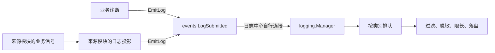

# 全局信号与日志中心设计

状态：阶段 1、2 已完成，全局日志契约、中心、生命周期及全部业务日志生产者已接入；阶段 3 的查询与命令改造尚未实施。实施进度以[任务清单](tasks.md#全局信号与日志统一改造)为准；当前架构见 [architecture.md](architecture.md#信号与订阅)。本文同时约定查询改造的目标行为。

## 目标与范围

业务通过全局日志信号提交记录，日志中心自行订阅，统一过滤、脱敏、限长、排队、落盘、轮转和查询。业务不持有文件 Logger，也不需要经 App 转发或逐层注入日志发布器。

通用信号机制继续服务日志以外的系统。本轮只实现全局日志契约和日志迁移，不批量迁移其他业务信号，不改远程部署。

以下行为保持不变：

- 全部退出共享既有的 30 秒预算；超时后仍在运行的任务及其依赖交给进程退出处理。
- SQLite 业务持久化、权限判断、可改写 Hook 和关键提交继续同步执行。
- 保留日志文件前缀、按日轮转、保留天数及现有配置项。
- 日志／信号运行期故障报告后继续运行；初始化失败返回主程序退出，不增加自动重启策略。
- 终端交互输出属于用户界面；本轮不把这些输出强行转换成文件日志。

## 信号所有权与使用范围

信号的定义、发射和连接是三个职责：定义约定事件数据，发射报告事件，连接注册消费者。全局信号只有进程范围的公共契约和订阅关系，不持有业务管理器、配置、文件或数据库。

| 所有者 | 职责 |
| --- | --- |
| `internal/signal` | 类型化信号、连接、执行器、队列、背压、断开和排空；不认识日志和业务 |
| `internal/events` | 全局信号及其数据契约；只依赖信号机制、标准库和必要的基础事实类型 |
| 来源模块 | 固定事件快照，发射全局事件；保留自己的实例内部信号 |
| 订阅模块／中心 | 自行连接、处理事件，持有并清理自己的连接和队列 |
| App | 创建服务并协调启动、停止准入和关闭顺序；不转发全局事件，不注入日志入口 |

全局契约是显式的包依赖，不需要再将同一个入口通过各层构造参数传递。业务和日志中心共同依赖 `events`；`events` 不反向导入它们。禁止建立字符串事件名加任意载荷的通用注册表。



已有业务信号转换成日志记录的代码归来源模块维护。例如 Agent 自己将 `ModelCallCompleted` 投影为记录，再提交全局日志信号。这个本地投影同步执行，不增加异步中转队列；通知、状态等消费者仍可以独立订阅原业务信号。

### 其他全局事件的候选

| 场景 | 使用边界 |
| --- | --- |
| 系统运行告警 | 不可用、恢复、后台异常等事实，由通知或状态中心订阅 |
| 平台连接状态 | 平台连接、断开、重连成功，携带平台和必要的实例身份 |
| 配置变更 | 成功应用后广播；校验、应用和失败返回仍归配置模块 |
| 后台任务状态 | 开始、完成、失败的观察事实；调度和执行不交给广播保证 |
| 模型调用与重试统计 | 可用于全局观测，必须携带实际调用关联信息 |
| 会话／请求状态 | 只共享事实快照；有效性判断、取消和事务控制仍归所属实例 |

这些是适用原则，不是本轮新增信号清单。当前包含活跃 `Binding` 的会话事件不能直接原样搬入公共包；Elvena 的请求派发需要返回结果，也不直接改成广播。

## 包、文件与命名

本轮只新增 `internal/events` 一个 Go 包，不建立 `logevent`、`systemlog` 或 `logging/events` 包。全局事件按领域分文件，未来有真实需求时再添加其他领域文件。

| 位置 | 目标职责和主要名字 |
| --- | --- |
| `internal/events/logging.go` | `LogCategory`、`LogRecord`、`LogDiagnostic`、`DiagnosticError`、`LogSubmitted`、`EmitLog` |
| `internal/events/logging_test.go` | 发布时间、关联身份、错误和可变字段快照 |
| `internal/signal/signal.go`、`queue.go` 等原有文件 | 保留通用 `Signal[T]`、`Emit`、`Connect`、`Connection`、`Queue` 语义 |
| `internal/signal/diagnostics.go` | 设施故障直写 stderr；测试可捕获输出，不接受业务文件 Logger |
| `internal/logging/logging.go` | `Manager`、`NewManager`、文件写入、轮转及清理 |
| `internal/logging/signals.go` | 日志中心订阅、分类队列、停止准入和排空 |
| `internal/logging/record.go` | 运行级别过滤、记录内容处理与大小限制 |
| `internal/logging/reader.go` | 从文件末尾分块查询 |
| `internal/agent/logging.go`、`internal/session/naming_signals.go`、`internal/modelmgr/signals.go` | 已有业务事实到日志记录的同步投影；来源模块管理连接，不另建中转队列 |
| 各模块原有构造与关闭文件 | 建立本地投影订阅并清理；删除 Logger／Audit 依赖装配 |

测试优先扩展相关包现有测试文件。只有职责需要单独覆盖时新增测试文件，不增加平行的日志实现或公共测试框架。

### 公共契约

公共声明及字段语义：

```go
type LogCategory string

const (
    LogRuntime LogCategory = "runtime"
    LogAudit   LogCategory = "audit"
    LogElnis   LogCategory = "elnis"
)

type LogRecord struct {
    At        time.Time
    Category  LogCategory
    Level     slog.Level
    Name      string
    Module    string
    Summary   string
    Detail    string
    Fields    []slog.Attr
}

type LogDiagnostic struct {
    Kind   string
    Detail string
}

type DiagnosticError interface {
    LogDiagnostic() LogDiagnostic
}

// 类型为 *signal.Signal[LogRecord]，进程内保持同一个实例。
var LogSubmitted *signal.Signal[LogRecord] // 包初始化时创建一次。

func EmitLog(ctx context.Context, record LogRecord) error
```

- `Name` 对应落盘字段 `event`，使用稳定事件名，如 `llm_error`；`Module` 对应 `module`，如 `agent`、`model`、`hook`。Hook 相关审计统一标为 `hook`。
- `Summary` 对应记录消息，`Detail` 对应详情。`Fields` 保留结构化业务字段，包含现有查询所需的 token 用量、文本摘要和关联 ID 等。
- 级别由来源明确指定，不根据事件名中的 `failed`、`error` 等字符串推断。公共包可使用 `slog.Level`、`slog.Attr` 数据类型，不持有 `slog.Logger` 或 Handler。
- 全局信号只用于连接；生产日志统一通过 `EmitLog` 发射，以执行快照契约。`EmitLog` 不写文件、不读取当前日志级别、不创建自己的队列。
- `EmitLog` 的返回值描述提交错误，不保证文件写入成功。记录失败不能替代或覆盖原业务结果；设施负责报告派发和消费错误。
- 来源协议实现 `DiagnosticError`，将协议特有内容转换成通用值。记录者只按该接口提取诊断，不断言 `responses.APIError`；Responses 仍只选择错误相关载荷，不把完整响应或请求塞进诊断。

### 方法和变量

| 名称 | 约定 |
| --- | --- |
| `Emit`、`Connect`、`Disconnect` | 继续使用通用信号 API，不增加另一套 Publish／Subscribe 命名 |
| `EmitLog(ctx, record)` | 构造发布快照并发射全局日志信号 |
| `Manager.HandleRecord(ctx, record)` | 全局信号回调，按类别提交到中心的队列；不是业务调用入口 |
| `Manager.BeginClose()` | 停止日志准入并唤醒背压等待者，不等待回调结束 |
| `Manager.Close(ctx)` | 使用传入的共同退出预算，排空并关闭日志资源；不另开 30 秒预算 |
| `record`、`connection`、`queue`、`logManager` | 分别用于记录、订阅连接、执行队列、中心实例 |
| `connections`、`queues` | 由对应订阅者持有；App 不集中存储全项目订阅 |

`NewManager` 保留现有构造职责，成功返回前完成自己的全局订阅。业务统一使用 `events.EmitLog`；不提供 `Runtime`／`Audit`／`Elnis` Logger、`SetLogger`、`auditFunc`、`writeAudit` 或日志发布器构造参数。

## 发布与消费契约

### 快照

`EmitLog` 在发射前补齐未指定的发生时间，从实际调用 context 提取已有的 `session_id`、`run_id`、`attempt`、`request_id`、`root_request_id`。来源事件已固定的时间和身份优先，不用消费时的当前会话覆盖。

发布前复制字段切片、嵌套分组及可变载荷，解析延迟求值的数据，固定错误文本和通用错误诊断。异步任务不持有可变 map、slice、业务管理器或活跃执行对象；不能仅复制切片外层就认为完成快照。

发布快照的递归深度上限为 32，遍历预算为 16384 个值；循环或超限载荷使用 `[snapshot limit]`，不支持的值使用 `[unsupported log value]`。订阅者只读共享快照，不修改字段。显式提供的关联字段（包括空值）不被 context 覆盖。

全局信号无历史重放能力，不承担持久消息总线职责。生产装配必须先建立日志中心，再启动会发日志的业务；中心尚未建立时的初始化失败直接返回主程序报告。

### 队列与生命周期

日志中心拥有 runtime、audit、elnis 三个串行队列，每个容量 256，使用背压和 Drain，按成功入队顺序消费。不同类别之间不保证总顺序。

`HandleRecord` 同步选择类别并提交对应队列，提交时使用不随单次请求取消的 context，保持现有 FollowExecutor 的生命周期语义。请求取消不撤销已发布的日志事实；中心停止准入会唤醒等待容量的生产者。记录内容处理和文件写入在消费者中完成。

进程内只允许一个活动日志中心。重复构造不能悄悄增加第二份文件消费者；初始化中途失败要清理已获得的连接、队列和文件。全局信号实例不因中心关闭而替换。

退出继续使用现有顺序约束：先取消运行并停止准入、唤醒背压生产者，再等待生产者和消费者退出，最后关闭已不被使用的底层资源。App 调用中心及模块的生命周期方法，不接管它们的连接列表。超时后不能声称 Drain 成功，也不能在回调仍使用文件时强行关闭文件。最终断开中心持有的连接，测试结束也必须清理订阅。

涉及全局订阅的测试不能并行争用同一全局入口；需要多个完整应用实例时使用进程隔离。纯格式化、查询和无全局状态的测试可以并行。

### 设施故障

信号派发失败、回调失败、日志写入失败和未完成排空直接报告 stderr，由终端或服务管理器收集。设施诊断不能发送日志信号，不能使用业务文件 Logger，不能受 `runtime.log_level` 过滤。

文件写入错误必须被消费者检查并返回，不能被 `slog.Logger` 便捷方法静默丢弃。关闭与初始化错误仍向生命周期调用方返回。预期取消按已有信号语义处理，不升级为应用故障；真实故障不能被取消错误掩盖。

## 记录与查询规则

| 项目 | 规则 |
| --- | --- |
| 运行级别 | `runtime.log_level` 只过滤运行日志 |
| 审计与 Elnis | 独立保留业务事实；`/usage` 所需 `llm_usage` 不因运行级别升高而消失 |
| 严重程度 | 正常事实 INFO、业务失败 WARN、持久化等设施操作失败 ERROR；预期取消不升级 |
| 正文 | 普通运行日志记录摘要；开启 DEBUG 后允许详情，不为显示正文默认启用 DEBUG |
| 上游失败 | 审计保留通用错误诊断，不依赖 DEBUG；用户仍收到简短错误说明 |
| 摘要 | 默认最多 256 个 Unicode 字符 |
| 详情 | 单项最多 8 KiB，按 UTF-8 边界截断并标记 |
| 单条记录 | 序列化后最多 64 KiB，优先保留事件名、模块和关联字段，缩减详情及其他大字段并标记 |
| 脱敏 | 在截断前处理凭据、认证头、cookie、媒体内嵌载荷和嵌套结构；token 用量、`token_name` 等业务元数据保留 |

来源决定记录什么业务事实；日志中心统一决定可落盘的内容形式和上限。来源处需要保护用户提示、挑选协议载荷时可以先缩减或脱敏，但不能因此绕过中心处理。

阶段 3 的查询目标：从文件末尾分块读取，按从新到旧的顺序逐条筛选，达到数量立即停止；循环读取和处理行时检查取消，不把整天记录加载进内存。继续支持跨日、字段、正文和原始记录筛选。读取内存受分块和单行上限约束，另加实际返回结果占用；旧记录保留 16 MiB 单行读取上限，超限明确报错。

阶段 3 的命令目标行为：

- `/log` 查询用户／助手正文和 system prompt 的摘要或 DEBUG 详情。
- `/audit` 移除 `-u`、`-a` 及旧用户／助手消息事件别名，同步移除帮助和补全。
- `/audit --hook` 筛选 `module=hook` 的真实审计记录，不再匹配不存在的 `event=hook`。
- 不迁移历史文件来补造模块字段；新筛选规则只匹配实际带有所需字段的记录。

## 日志职责归属

| 记录来源 | 当前归属 |
| --- | --- |
| Agent 模型、工具、回复等事实 | Agent 内部同步日志投影；提交全局记录 |
| 会话命名事实 | Session 模块自身日志投影 |
| 模型重试 | Model Manager 独立日志投影；App 单独订阅通知 |
| 上游错误 | 协议来源提供 `LogDiagnostic`，消费者只依赖公共契约 |
| Hook 失败 | 原始执行失败由 Hook Manager 记录一次；Agent 保留失败通知及自身桥接故障记录 |
| 各业务模块诊断 | 来源直接调用 `events.EmitLog` |
| 日志队列和连接生命周期 | 日志中心与来源模块分别持有自己的订阅资源 |
| Signal／Queue 设施故障 | 信号设施的独立 stderr 报告 |

所有业务日志均经过全局链路的集中脱敏、限长和分类队列，不保留旧 Logger 兼容层或双写路径。App 只管理自己的通知、状态订阅和服务生命周期；终端界面输出及设施 stderr 报告使用各自入口。

## 分阶段实施与验收

实施分为三个阶段，进度只在[任务清单](tasks.md#全局信号与日志统一改造)维护。本文作为实施基线，不单独占一个阶段。开始代码实施前运行相关基线测试，记录原有失败；每阶段完成后保持可编译，运行相关测试，公共接口变更还要运行更大范围测试。是否提交由用户决定。

### 阶段 1：建立全局信号与日志中心

- 实现 `events` 日志契约、发布快照、分类队列和中心自身订阅。
- 落实独立等级过滤、集中脱敏、摘要／详情及记录大小限制。
- 将 Signal／Queue 的诊断切换到独立 stderr，接入现有共同的 30 秒退出预算。
- 新旧路径并存仅服务后续迁移，不提前删除尚有调用者的接口；不为同一记录增加双写。
- 验收：真实全局信号能落盘；重复中心初始化被拒绝；启动失败资源清理、字段快照、背压、取消、Drain 和超时均有测试。
- 注入文件写入失败，验证 stderr 可见、原业务继续、没有递归日志；验证运行级别不影响审计和 Elnis 事实，覆盖敏感嵌套字段、长中文、错误详情和序列化记录上限。

### 阶段 2：迁移全部日志生产者

- 来源模块接管 Agent、模型和会话等日志投影，移除相应 App 消费者和中转队列。
- 消除公共消费者对具体协议的依赖，保留上游错误详情；修复重试遗漏和 Hook 重复记录。
- 迁移平台、Cron、Elnis、Hook／插件、命令、工具预载、媒体、发送、通知、维护及启动记录，全部遵循统一摘要／详情规则。
- 删除旧 Logger／Audit 参数、接口、回调和装配代码；保留同步业务持久化。
- 验收：用户／助手记录和审计事实正确，来源事件时间与身份保持不变，通知未被迁移删除，失败只在预期位置记录一次；WARN／ERROR 运行级别仍保留 `/usage` 所需数据。
- 生产装配覆盖各模块的日志路径及启动期记录；边界检查阻止业务重新使用文件 Logger、绕过发布快照或在公共消费者中导入具体模型协议。

### 阶段 3：查询、命令与整体收尾

- 改为反向分块查询，修正命令选项、筛选、帮助和补全。
- 大文件测试覆盖提前停止、跨块长行、跨日筛选和及时取消；通过读取量或等价可观察证据验证没有扫描完整文件，不只比较查询结果。
- 随实际代码改造更新中文用户文档、CHANGELOG、架构和代码地图；只将实际完成的行为写成当前架构。本轮设计文档调整只涉及本文和任务清单。
- 执行 gofmt、全量 Go 测试、信号／日志相关 race 测试及依赖边界检查。
- 回归生产装配、启动失败清理、重复初始化、订阅释放、背压及原有 30 秒退出语义。
- 验收：查询与命令行为正确，无遗留双写和旧装配入口，任务清单与文档描述一致；不手动修改英文镜像。

## 设计参考

- [Godot：Using signals](https://docs.godotengine.org/en/stable/getting_started/step_by_step/signals.html)：信号声明、发射和连接。
- [Godot：Signal](https://docs.godotengine.org/en/stable/classes/class_signal.html)：信号引用及连接生命周期。
- [Godot：Singletons / Autoload](https://docs.godotengine.org/en/stable/tutorials/scripting/singletons_autoload.html)：全局访问与启动顺序。
- [Godot：Autoloads versus regular nodes](https://docs.godotengine.org/en/stable/tutorials/best_practices/autoloads_versus_regular_nodes.html)：适合全局系统的职责边界。

ElBot 借鉴全局信号的使用方式，不复制 Godot 的节点树和帧循环。Go 中的后台队列、背压、context、连接清理和退出排空仍遵循本项目的显式生命周期。
