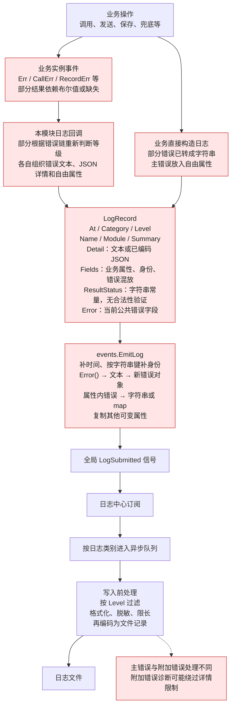
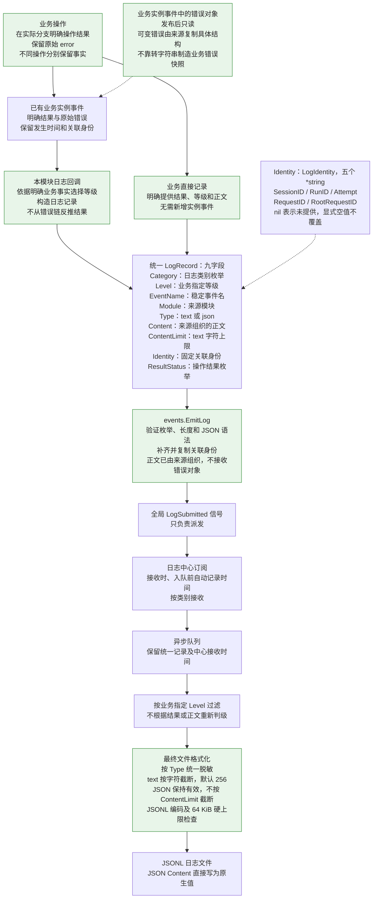

# 信号与日志系统设计

本文汇总已确认的信号与日志设计、当前问题、目标契约和验收要求。实施状态见 [任务清单](tasks.md#信号与日志系统整改)，当前代码职责见 [架构说明](architecture.md#信号与订阅) 和 [代码地图](code-map.md#信号与订阅)。

当前已有全局日志信号、日志中心、来源模块日志回调和平台连接全局信号；本文中的九字段契约、枚举约束、text／JSON 正文、JSONL 写入和全部来源结果迁移尚未实施。目标设计不能作为代码已经完成的证明。

本次只更新文档，不修改 Go 代码，不运行文档或代码验证，交由用户审阅。用户修改的 `AGENTS.md` 不改动、不覆盖；下文的实施和验收要求用于后续步骤。

## 已确认的要求

- 信号机制参考 Godot 的声明、发射和连接方式，是通用能力，未来可以服务日志以外的系统。
- 全局契约集中定义，各业务和中心自行连接。业务日志通过全局日志信号交给日志中心，不经 App 转发，也不逐层注入 Logger、日志发布器或同一全局信号。
- 业务决定日志等级和操作结果，原始错误保留在业务返回值和业务实例事件中。日志的 `Level`、`ResultStatus`、`Content` 各有职责，不能相互机械推导。
- 操作结果由掌握上下文的业务来源确定，来源事件完整传递事实。日志回调、信号和日志中心不通过错误树、错误文案或事件名反推取消、拒绝和失败。
- 日志来源组织正文，将错误原因及必要诊断写入 `Content`；普通日志优先 text，需要业务字段筛选、统计或解析的记录使用 JSON。JSON 由来源构造并先控制体积，公共日志不再传递错误对象或任意 Go 对象。
- 不新增 Go 包，不建设共享错误分类器、取消判断器或错误树检查设施；不为未知需求预先增加抽象。
- 所有包、文件位置、包名、文件名、函数名和变量名必须与用户讨论确认。可以提出候选供用户修改，不能自作主张。已有名称、已确认的新名称和待讨论项必须区分；本文不授权未讨论的命名或文件拆分。
- 本轮只处理已明确的日志和信号整改，不改变重试策略、权限规则、同步业务持久化、队列策略或共同的 30 秒退出预算，不自动提交。
- 所有日志使用统一的九字段公共记录、同一个发布入口和处理规则，不按具体业务另建公共日志结构，不保留摘要、详情、错误对象或额外信息入口。
- 日志和 notify 各自负责自己的输出。日志中心不决定是否向平台通知，也不生成通知摘要；来源独立组织面向用户的通知。
- 底层定义型字段必须在 Go 注释中说明用途、填写方、零值和约束。先写文档，再实现底层，再迁移来源和命令；允许业务暂时编译失败，不为维持全仓编译提前扩大迁移范围，全部步骤完成后再运行全量测试。

## 现状与目标链路

### 当前形态

红色节点表示需要整改的路径。不是所有发布点都同时存在这些问题；当前代码仍保留公共 `Error` 字段，多数来源仍在使用自由错误字段。此图描述现有代码，不表示这些字段属于目标契约。



具体问题包括：

- 部分来源仅凭错误链中存在 `context.Canceled` 降级，合并错误中的真实失败被掩盖。
- 工具解析阶段把后台策略拒绝降为普通原因字符串，后续无法准确识别拒绝事实。
- 公共发布快照把错误文本包装成新 `error`，增加重复转换；目标中日志来源可以把错误原因写成正文，原始错误保留在业务链路，不再进入公共日志契约。
- 附加属性中的错误被提前转成字符串或 map，详情展示规则与正式主错误不一致。
- `Detail` 混用普通文本和预编码 JSON；固定身份混在开放属性中；结果字符串没有合法性验证。

普通和后台预载跳过事件名已经修复，分别为 `skill_wrapper_preload_skipped`、`background_preload_skipped`，明确记录跳过结果；后续迁移应保留该回归。

### 最终形态



“日志回调”是已有业务事件到 `LogRecord` 的转换代码，旧文档称为“日志投影”。它归来源模块、同步执行，不是新的中心或 Go 包，不另建异步中转队列。没有业务事件的直接记录点不必为日志新增事件。通知、状态等消费者仍可独立订阅原业务事件。

业务实例事件仍可保留原始错误和事实发生时间；这不等于公共日志要携带 `Error` 或 `At`。来源在构造日志时将错误原因和必要诊断写入 `Content`，公共日志的时间由中心接收时记录。日志与 notify 不互相承担内容组织或发送决策。

## 信号所有权与依赖边界

| 所有者 | 职责 |
| --- | --- |
| `internal/signal` | 类型化信号、连接、执行器、队列、背压、断开和排空，不认识业务或日志 |
| `internal/events` | 全局信号及数据契约，不持有业务管理器、文件、配置或数据库，不反向依赖业务和日志中心 |
| 来源模块 | 确定业务事实和结果，发布事件，维护自身实例事件及日志回调 |
| 订阅模块／中心 | 自行连接、处理事件，持有并清理自己的连接与队列 |
| App | 服务装配、启动和关闭协调，以及自身通知和状态订阅，不转发全局日志或平台连接事实 |

业务和中心共同依赖显式的全局契约，不建立“字符串事件名 + 任意载荷”的通用事件注册表。保留已有 `Signal[T]`、`Emit`、`Connect`、`Disconnect` 等机制名称和显式生命周期。

全局信号适合多个独立系统共同观察的进程级事实；实例内部状态仍归实例。全局信号不缓存、不重放，不承担持久消息总线职责。定义和发布属于掌握事实的模块或公共契约，消费属于需要该事实的中心，不能为了日志倒置依赖。

| 场景 | 已确认边界 |
| --- | --- |
| 日志提交 | 全局日志信号，日志中心自行订阅 |
| 已有平台连接成功事实 | 全局信号，各平台直接发布，Hook 和 Cron 自行订阅 |
| 系统告警、配置应用完成、后台任务状态 | 适合全局观察的候选，不是本轮新增任务；应用、调度和错误返回仍由业务执行 |
| 模型重试 | 客户端自己执行；保留模型实例信号、来源日志和独立通知，不新增全局重试信号 |
| 会话／请求状态 | 保留实例边界，活跃 `Binding` 等执行对象不能直接搬进全局载荷 |
| 权限、可改写 Hook、Usage 和关键持久化 | 同步完成，不依靠广播保证业务结果 |
| 查询 Reader、维护清理、Elvena 请求派发 | 需要返回结果的调用保持同步调用语义，不改成广播 |

## 公共日志字段与命名

以下是已经确认的目标 `LogRecord` 全部九个字段，定义位于现有 `internal/events/logging.go`。每个字段的 Go 注释必须写明用途、填写方、零值含义和约束，不再增加自由属性或其他扩展入口。

| 字段 | 类型或约束 | 含义与输出 |
| --- | --- | --- |
| `Category` | `LogCategory`，受验证的枚举；来源必填，零值非法 | runtime／audit／elnis，决定日志类别与文件，落为 `category`，不判断业务结果 |
| `Level` | `slog.Level`；来源指定，Go 零值为 INFO | 业务指定的关注等级，落为 `level` |
| `EventName` | `string` | 替换 `Name`，稳定事件标识，落为 `event` |
| `Module` | `string` | 来源模块，落为 `module` |
| `Type` | `LogContentType`，受验证的枚举；零值为 text | 正文格式，落为 `type`，不猜测正文是否像 JSON |
| `Content` | `string` | 唯一正文；自然文本或来源编码的有效 JSON，落为 `content`；JSON 直接写为原生 JSON 值 |
| `ContentLimit` | `int`；负数非法；零值默认 256 个 Unicode 字符 | 来源控制 text 保留长度；截断标记计入上限，不落盘；JSON 不使用此限制，来源先控制体积 |
| `Identity` | `LogIdentity`；五个 `*string` | 固定关联身份，区分未提供与显式空值，具体见下表 |
| `ResultStatus` | `ResultStatus`，受验证的枚举 | 业务明确的操作结果，非零落为 `result_status`；零值表示未声明，不默认成功 |

时间由日志中心在接收记录、进入类别队列前自动记录，以 RFC 3339 时间写为 `time`，业务不填写。公共记录不保留 `At`、`Summary`、`Detail`、`Error`、`Fields`、`BusinessAttributes`，也不增加 `Extra`、`Payload` 或 `Data` 等扩展字段。`Text`／`TextLimit` 的名称统一为 `Content`／`ContentLimit`。

### 枚举与稳定标识

`ResultStatus` 采用已讨论的 `uint8` 和 `iota` 枚举形式：

```go
type ResultStatus uint8

const (
    ResultUnspecified ResultStatus = iota
    ResultSucceeded
    ResultFailed
    ResultCanceled
    ResultRejected
    ResultSkipped
)
```

写入时分别映射为不输出结果字段、`succeeded`、`failed`、`canceled`、`rejected`、`skipped`。零值明确为未声明，不默认成功。操作结果日志必须由来源填写；普通提示、启动过程和进度可以不填。失败结果不强制伴随 Go `error`。

`LogCategory` 同样使用 `uint8` 和 `iota`：`LogRuntime=1`、`LogAudit=2`、`LogElnis=3`，分别输出 `runtime`、`audit`、`elnis`。保留已有常量名称及文件类别，零值非法，不能默认为 runtime。

`LogContentType` 使用 `uint8` 和 `iota`：`ContentText=0`、`ContentJSON=1`，分别输出 `text`、`json`，普通文本为默认值，不增加 plain 别名。

三个枚举均提供 `Valid() bool` 和 `String() string`。未声明结果及非法值的 `String()` 返回空字符串；非法值必须由验证拦截，不能静默写入或纠正。

Go 的整数枚举不能阻止强制转换非法数值，因此发布入口仍要验证。非法结果、类别或正文类型，以及负数长度、无效 JSON，均属于契约错误，走设施诊断和提交错误返回，不默默纠正、不推断业务结果、不递归发送日志。

事件名由来源代码显式定义，不从正文替换空格生成，不随展示文案改变。`Module` 与事件名描述来源和事实，不用来猜等级。新增命名仍须按用户要求讨论，不建立全局字符串分类表。

### 身份与正文

- `Identity` 包含 `SessionID`、`RunID`、`Attempt`、`RequestID`、`RootRequestID`，写入时展开为现有下划线字段名。来源已固定的值优先；未提供的值可从实际调用 context 补齐，明确为空的值不得被覆盖。

| `LogIdentity` 字段 | 类型 | 落盘字段 |
| --- | --- | --- |
| `SessionID` | `*string` | `session_id` |
| `RunID` | `*string` | `run_id` |
| `Attempt` | `*string` | `attempt` |
| `RequestID` | `*string` | `request_id` |
| `RootRequestID` | `*string` | `root_request_id` |

`nil` 表示未提供；非 nil 且指向空字符串表示明确为空。`EmitLog` 只为缺失项补实际 context 中存在的身份，并复制指针指向的字符串。来源后续修改自身变量不能改变已发布身份；所有订阅者只读，异步消费不查询当前会话来补身份。

- `Content` 是唯一正文。普通日志尽量使用 text；需要业务字段筛选、统计或解析时，由来源构造 JSON 并明确填写 `Type=json`。不按具体业务扩充公共字段，也不统一把所有日志改成 JSON。
- `Type=text` 按自然文本处理，`Type=json` 才按 JSON 处理。正文内的业务键不提升为公共字段，即使包含 `level`、`event` 或 `result_status`，也不能覆盖外层正式字段。
- 原始错误留在业务返回值及实例事件中；日志来源将错误原因与必要诊断组织为正文，不将错误对象放入公共记录。不同操作优先分别记录，需要汇总时由业务明确各操作事实。
- 不向公共日志提交任意 Go 对象、map、切片、延迟求值器或 `slog.Value`，不建设反射转换器。正文已经是不可变字符串，身份指针由发布入口复制。

### 错误诊断与通知边界

公共日志不保留 `DiagnosticError`、`LogDiagnostic()` 或 `LogDiagnostic` 契约，不在最终写入时提取错误对象诊断。来源可以在构造 `Content` 时调用错误的文本接口或编码必要 JSON；日志中心只处理固定公共字段和 text／JSON 正文，不认识具体协议错误。

协议来源负责选择与错误有关的载荷，不把完整请求、响应正文或媒体数据塞入诊断。错误原因及必要诊断进入业务组织的正文，不参与日志中心的业务结果分类。

日志和 notify 是独立链路。给平台返回的内容或简短说明由通知来源组织，不是日志的 Summary，不以日志写入成功、等级或正文自动决定是否通知。日志查询需要的展示由查询命令处理，不为此增加公共摘要字段。

## 业务结果与错误所有权

### 来源确定结果

业务在实际成功、取消、拒绝、跳过或失败的分支确定结果。来源收到的底层错误由该业务结合上下文解释，不能把缺失的信息留给日志回调补猜。事件类型本身已明确表达的结果可以直接使用，不给所有实例事件统一添加 `ResultStatus` 或 `slog.Level`。

来源日志回调根据完整事实决定业务等级并构造记录。既有业务约定为重试 WARN、最终失败 ERROR、预期取消 INFO、正常策略拒绝 WARN；持续重连、发送降级和待重投递等可恢复情况保持来源的 WARN 语义。导致操作最终失败的超时为失败，特殊场景由所属业务明确判断。日志中心不强制 failed 对应 ERROR，也不根据 canceled 自动降级。

| 场景 | 必须保留的事实 |
| --- | --- |
| 调用取消、保存失败 | 调用为 canceled，保存为 failed，各自保留错误；业务决定必要的汇总结果 |
| 调用成功、保存失败 | 不能把保存失败归为上游调用失败，也不能把整体记录为成功 |
| 工具策略拒绝 | 解析阶段保留拒绝事实和类型化错误，复用已有 `PolicyDeniedError`；不能降为原因字符串再重建普通错误 |
| 工具拒绝、记录保存失败 | 拒绝与保存失败独立保留，拒绝不能覆盖真实故障 |
| 工具不存在、配置缺失或执行故障 | 与正常策略拒绝区分，不能仅凭 `Success=false` 判为同一种情况 |
| 命名失败、兜底保存失败 | 原始命名失败不被兜底失败覆盖，两项操作保留各自结果和错误 |
| 回复发送、持久化、消息关联 | 保留各操作的实际结果，已发送或已保存的事实不能被总体失败抹去 |
| Chat 为保留部分输出返回空错误 | 仍显式传递取消或失败事实，不能由 nil 错误推导成功 |
| 重试或视觉回退 | 保留本次尝试失败、次数或回退事实，不把 retrying 增加为结果种类 |

`CallError`、`PersistenceError`、`FallbackError`、`SendError` 是讨论过的业务操作命名示例，不是公共错误类型枚举，也不是必须加到每个结构中的固定字段。各事件最终字段必须与对应结果一起列全、讨论确认后实施。不使用含糊的 `outcome` 或 `err` 作为新公共契约名，不批量重命名无关局部 `err`。

### 业务错误与日志正文

业务返回值和业务实例事件保留原始错误对象、各操作事实和必要的发生时间。来源在日志构造边界把错误原因及必要诊断写入 `Content`；全局日志信号和队列只传统一记录，不再传错误对象，也不把日志文字重新包装成业务错误。

业务实例事件中的错误发布后只读，所有订阅者也只读。来源若持有可变错误结构，必须复制自己掌握的具体结构及其可变成员再发布，不能发布后继续修改。Go 的 `error` 没有通用克隆能力，本设计不承诺自动深复制任意错误类型，也不通过反射拆解或字符串化来伪装成保留原始错误。

业务返回值可以继续携带必要的合并错误，但来源事件不能只剩一个合并错误而丢失各操作事实。日志回调不遍历它来重新分类。记录失败不能替代或覆盖原业务结果。

业务实例事件的错误所有权与日志正文转换分开：原始错误供业务处理，日志、数据库持久化及用户回复分别在各自输出边界生成内容；不能把这些输出文字回读为业务处理所需的原始错误。

## 发布、消费和生命周期

- `LogSubmitted` 在进程生命周期中保持同一实例；生产日志通过 `EmitLog` 发布，不能绕过公共入口直接发射全局日志信号。
- `EmitLog` 验证枚举、非负长度和 JSON 语法，补齐并复制关联身份，不写文件、不读取当前日志级别、不创建队列、不接收业务错误对象。
- 公共日志正文已经是不可变字符串，不接受任意可变载荷或延迟求值对象；删除通用反射快照与错误文本快照。业务实例事件中的错误继续遵循上一节的只读所有权约定。
- 不向异步消费者传递业务管理器或活跃执行对象。身份在发布时固定；中心在接收记录、入队前记录时间。队列消费时不重新取当前时间或当前会话覆盖已固定值。
- 日志中心自行订阅，拥有 runtime、audit、elnis 三个串行队列，每个容量 256，满时等待容量，关闭采用 Drain。按成功入队顺序处理，同类别之外不保证总顺序。
- 单次请求取消不撤销已发布事实，也不解除日志背压；中心停止准入唤醒等待者。过滤、正文脱敏、text 限长和文件格式化在中心消费者中执行。
- 进程内只允许一个活动日志中心。初始化失败清理已取得的连接、队列和文件；重复构造不能形成双写；关闭不替换全局信号实例。
- App 先建立日志中心和消费订阅，再启动会发日志的业务。中心建立前的初始化失败直接返回主程序报告。
- 所有退出共享既有的 30 秒预算：停止准入、取消运行并唤醒生产者，等待生产者和消费者，最后关闭已不被使用的资源。超时不能声称排空成功，也不能强行关闭仍被回调使用的文件或依赖；剩余工作交给进程退出处理。
- 全局订阅测试不得并行争用同一入口；多个完整应用实例需要进程隔离。纯格式化、查询及无全局状态的测试可以并行。

各阶段的具体职责如下；图中业务事件保留错误和发生时间，与公共日志接收已组织正文、由中心记时的边界一致。

| 阶段 | 职责 |
| --- | --- |
| 业务来源 | 确定事实、结果、等级、正文类型及内容；text 指定所需长度，JSON 自行控制体积；独立组织 notify |
| `EmitLog` | 验证公共契约，补齐并复制身份，发射统一记录 |
| `LogSubmitted` | 只负责派发，不分类、不持久化、不重放 |
| `handleRecord` | 接收时记录时间，按类别入队；消费者按来源等级过滤并调用写入 |
| `formatRecord` | 按 Type 脱敏，text 按字符截断，JSONL 编码和记录硬上限检查 |
| 查询命令 | 按公共字段及已知 JSON 业务契约筛选、统计或展示；所有条件匹配后计入数量上限 |

### 设施故障

信号派发、回调、文件写入、非法公共契约及未完成排空等设施问题直接走独立 stderr，由终端或服务管理器收集，不受运行日志级别过滤，不递归发送日志信号，不依赖业务文件 Logger。

文件写入和短写错误必须被检查并返回；初始化和关闭错误返回生命周期调用方。运行期故障沿既有策略报告，不新增自动重启或一律崩溃的策略；初始化失败返回主程序退出。提交成功不等于持久化成功，正常取消与真实设施失败不能相互覆盖。

## 记录内容与查询

| 项目 | 约定 |
| --- | --- |
| 运行级别 | `runtime.log_level` 只过滤运行日志，中心使用业务提供的等级 |
| 审计与 Elnis | 独立保留事实；`llm_usage` 和 `/usage` 数据不因运行级别升高而丢失 |
| 正文 | 通过等级过滤后统一按 Type 和 ContentLimit 处理，不由中心在非 DEBUG 时额外隐藏或缩短；调试内容由来源明确使用 DEBUG |
| 最终上游失败 | 通过审计保留诊断，不受运行级别过滤；不改变给用户的简短错误提示，不修改上游重试策略 |
| text 长度 | 按 Unicode 字符截断，ContentLimit 为零时默认 256，正数由业务指定，截断标记计入上限 |
| JSON 长度 | 业务先控制体积，不按 ContentLimit 截断，保持完整有效 |
| 单条记录 | JSONL 编码后连同行尾最多 64 KiB；超限明确报告设施失败，不写半条记录，不截坏 JSON |
| 脱敏 | 先脱敏再截断，覆盖嵌套结构、凭据、认证头、cookie 和媒体内嵌载荷；保留 token 用量等业务元数据 |
| 文件 | 新记录统一写 JSONL；保留现有文件前缀、按日轮转、保留天数和配置，不改写历史记录 |

来源组织正文；最终写入阶段统一脱敏、text 限长、JSONL 编码和记录硬上限检查。普通正文直接使用 text，需要 JSON 的来源自行编码。`Type=json` 的正文写入原生 JSON 值，不再包成字符串，数值处理不能经浮点转换丢失精度。公共契约不保留自由属性、错误对象、双写或平行兼容入口。提交成功只表示准入，异步格式化或写盘失败由设施诊断报告。

runtime、audit、elnis 分别沿用 `elbot-日期.log`、`audit-日期.log`、`elnis-日期.log`。Reader 后续兼读历史键值文本和新 JSONL，包括同一文件内混合的两种格式。正文内的键不提升为公共字段，不能覆盖外层事件、等级、身份或结果。

Reader 保留从文件末尾按 64 KiB 分块读取、日期从近到远和文件内写入位置倒序筛选的行为。达到数量立即停止；读取和处理行时检查取消；打开文件后固定范围，不追赶追加数据，不按事件时间重新排序。支持跨块中文、长行、LF／CRLF、无末尾换行和跨日筛选，旧记录单行读取上限保持 16 MiB，超限报错。

- `/log` 的 `-u`、`-a`、`--system` 和原始记录展示行为保持；`-d` 或 `--level debug` 只影响查询展示，不提高运行记录等级。
- `/audit` 不提供 `-u`、`-a`；`--event` 按真实事件名筛选，不做旧别名替换。
- `/log --hook`、`/audit --hook` 按 `module=hook` 与其他条件取交集；帮助与补全使用实际事件，不虚构 `hook` 事件。
- Hook 工具调用保留 `hook_tool_call` 和 `source=rules|plugin` 来源事实；操作结果迁移到统一结果契约，不从旧 `status` 文本反推结果。正常业务状态属性与通用操作结果必须区分。
- 结果从公共字段读取，错误原因从正文读取，不为本轮新增命令选项，不为历史日志补造字段。命令只按 Type 解码正文；不能把无法解析的用量数据默默按零参与统计。

### 哪些来源使用 JSON

| 命令 | 需要 JSON 的来源及业务字段 | 可优先使用 text 的记录 |
| --- | --- | --- |
| `/usage` | `llm_usage`：provider、model、prompt_tokens、completion_tokens、total_tokens、cache_hit_tokens、elapsed_ms；按模型、日期、会话筛选和统计 | 用量正文必须可解析，不另建统计存储 |
| `/audit` | 需要按 tool、actor_id、risk 等业务字段筛选或结构化展示的审计记录 | 只需公共事件、模块、身份、结果或全文检索的记录 |
| `/elwisp` | Elnis 业务事件：elwisp_name、source、source_id、mode、event_key、event_id、token_name、tags 等筛选字段 | 不携带上述业务事实的运行提示 |
| `/log` | 只有确实需要结构化读取的正文才填写 JSON | 用户消息、模型回复、系统提示、通知、启动、重连、清理等普通运行日志 |

迁移所有日志查询命令时一起检查来源，不能只改解析端。具体 JSON 业务结构由来源和消费者约定，不给公共记录增加字段；不需要结构化读取的内容尽量用 text。JSON 业务条件必须在计入查询条数之前匹配，不先取满条数再过滤，也不将业务 JSON 字段并入外层公共字段。

### 落盘模拟

以下每行是一条 JSONL 记录。`ContentLimit` 不落盘；没有提供的身份省略，显式空身份输出空字符串，未声明结果不输出。

```jsonl
{"time":"2026-10-07T15:00:00+08:00","category":"runtime","level":"INFO","module":"app","event":"startup","type":"text","content":"ElBot 启动完成。"}
{"time":"2026-10-07T15:00:02+08:00","category":"runtime","level":"ERROR","module":"delivery","event":"notice_output_failed","type":"text","content":"Telegram 通知发送失败：连接超时。","session_id":"sess-demo","request_id":"req-demo","result_status":"failed"}
{"time":"2026-10-07T15:00:03+08:00","category":"audit","level":"INFO","module":"agent","event":"llm_usage","type":"json","content":{"provider":"demo","model":"demo-model","prompt_tokens":1200,"completion_tokens":300,"total_tokens":1500,"cache_hit_tokens":800,"elapsed_ms":2100},"session_id":"sess-demo","request_id":"req-demo","result_status":"succeeded"}
```

JSON Content 直接作为原生 JSON 值写入，避免整段重复转义；text 中的引号和换行仍按 JSON 标准转义。命令展示解码后的内容，原始模式保留物理记录。

## 来源职责与平台连接

迁移范围覆盖 Agent、工具、Session、模型客户端与 Model Manager、Hook、平台、发送、Cron、Elnis、媒体、命令、通知、维护和 App。逐个检查直接发布点及实例事件链路，不只修改几个日志辅助函数。

Agent、Session、Model Manager 自行维护实例事件的同步日志回调和连接释放。模型重试日志独立于 App 通知订阅；没有通知订阅者也不能漏日志，调用结束后不显示过期重试通知。Hook Manager 记录原始执行失败，Agent 保留通知与自身桥接故障，同一错误不因迁移重复记录。终端交互是用户界面，不强行改成文件日志。

平台连接全局信号属于保留的现有能力：

- `PlatformConnectedEvent{Platform string}`、`PlatformConnected` 位于现有全局契约，携带平台名称，不持有适配器或业务对象，不缓存重放。
- CLI、Telegram、QQ OneBot、QQ Official 在既有连接成功边界直接发布；QQ Official 的 READY 发布，RESUMED 不发布；不扩展 headless、远程 CLI 或断开／恢复等新事件。
- Hook 协调模块和 Cron 自行订阅、管理按平台惰性创建的队列。既有 `StartPlatformEvents` 在装配完成后、平台启动前调用，重复启动不重复连接，关闭后不重启。
- 每个平台队列容量 256、满时拒绝，同平台串行，跨平台和跨消费者隔离。保留发射 context 的值，解除单次调用取消；关闭采用 CancelPending，App 取消时停止消费。
- `BeginClose` 停止准入、断开连接并取消队列；关闭前已取得的发射快照不能在关闭后接纳任务。`Close` 使用共同预算等待，`Done` 表示实际退出。
- Hook 执行及输出、Cron 状态与过期一次性任务补执行保持原业务规则，不新增去重、补跑或调度策略。未退出任务仍使用的依赖保留到进程退出。

## 已有代码位置与实施前待确认项

下面仅列已有位置和职责，作为定位依据，不授权新建、迁移或自行命名文件。当前代码地图继续描述实际实现，不提前写成目标结构。

| 已有位置 | 职责边界 |
| --- | --- |
| `internal/events/logging.go` | 九字段公共日志契约、身份、枚举、全局信号和发布入口 |
| `internal/events/platform.go` | 已有平台连接全局契约 |
| `internal/signal/` | 通用信号、队列及独立设施诊断 |
| `internal/logging/logging.go` | 中心、文件资源、轮转和清理 |
| `internal/logging/signals.go` | 中心订阅、接收时间、队列准入、消费过滤及写入调用 |
| `internal/logging/record.go` | text／JSON 脱敏、字符限长、JSONL 编码与硬上限检查 |
| `internal/logging/reader.go` | 反向分块查询，后续兼读历史格式和 JSONL |
| `internal/agent/logging.go`、`internal/session/naming_logging.go`、`internal/modelmgr/logging.go` | 来源模块的日志回调，不依赖具体协议包来解释错误 |
| `internal/app/signals.go`、`internal/app/model_signals.go` | App 自身连接管理与模型通知接线，不转发日志 |
| `internal/session/naming_signals.go`、`internal/modelmgr/signals.go` | 来源实例事件契约，连接生命周期由所属服务负责 |
| `internal/agent/platform_signals.go`、`internal/cron/platform_signals.go` | 平台连接消费者的订阅、按平台队列和关闭 |

### 已确认的位置与实施接口

| 名称／签名 | 位置及约定 |
| --- | --- |
| `LogIdentity` | `internal/events/logging.go`，五个已确认的 `*string` 身份字段 |
| `LogCategory`、`LogContentType`、`ResultStatus` | 同一文件中的 `uint8`／`iota` 枚举，分别提供 `Valid() bool` 和 `String() string` |
| `EmitLog(ctx context.Context, record LogRecord) error` | 沿用公共发布入口，返回日志提交错误，不承载业务结果 |
| `handleRecord` | 沿用中心接收方法，在入队前自动记时 |
| `formatRecord(ctx context.Context, record events.LogRecord, at time.Time) ([]byte, error)` | 沿用最终格式化函数，移除旧 DEBUG 详情参数，接收中心记录的时间 |

九字段名称、正文格式和身份表示已经确认，不因实现便利改回含糊字段或增加兜底入口。沿用现有包及文件，不新增包或拆文件；底层字段注释写清职责、零值及处理规则。

后续来源迁移前仍必须向用户列出并确认：

1. 涉及模型调用、工具调用、命名兜底、回复发送与保存等来源事件的完整字段和类型，逐项明确各操作结果与错误的对应关系，不能只给出几个错误字段示例。
2. 受影响日志辅助函数、发布方法及新增或调整的变量名；任何新增、拆分、移动文件都要先给候选位置并讨论。

确认结果写回具体契约后，再进入相应代码实施；不能把待确认项理解为实现者可自行选择。

## 实施与验收

实施按 [任务清单](tasks.md#信号与日志系统整改) 的三个步骤推进。先将确认结果写入设计和任务文档，再修改公共底层；随后迁移全部来源、相关实例事件、Reader 和查询命令，最后整体复审。底层期间允许未迁移业务暂时编译失败，不为维持全仓编译提前迁移；全部步骤完成后再运行全量测试。各步骤只记录真实完成的验证，不沿用旧阶段勾选来表示新目标完成。本次只写文档，不运行验证。

验收必须覆盖：

- 真实业务入口的成功、纯取消、包装取消、最终超时、策略拒绝、跳过、重试及最终失败；取消伴随持久化失败、拒绝伴随其他失败不能降级丢失。
- Chat 部分输出与空返回错误、Responses 调用成功但保存失败、命名兜底失败、回复已发送但保存失败等组合结果。
- 确认来源组织正文，公共日志没有错误对象、通用诊断或任意属性入口；正文 Type 明确，JSON 原生写入且保持有效，过滤后才执行中心格式化。
- 验证业务实例事件中错误副本的只读所有权、公共身份的指针副本、关联身份补齐与显式空值，以及枚举、JSON、长度非法值的设施诊断。
- DEBUG／INFO／WARN／ERROR 下的过滤和统一正文规则；text Unicode 字符限长及标记、JSON 嵌套脱敏与数值精度、64 KiB 记录上限、外层正式字段保护；中心入队前记时，业务 JSON 条件匹配后才计入查询条数。
- 普通／后台预载跳过真实事件名查询、WARN／ERROR 下用量审计、无通知订阅者的重试日志、Hook 原始失败不重复记录。
- 生产装配、先订阅后启动、部分启动失败、重复中心、订阅释放、背压、关闭竞争及共同 30 秒预算；文件写入失败和未排空通过 stderr 可见，不递归记录。
- Reader 和命令现有行为，平台连接消费者隔离和既有 Hook／Cron 执行行为，日志与协议包的依赖边界。
- 后续代码修改运行 gofmt 和相关包测试，全部步骤完成后运行全量 Go 测试、相关 race 及依赖边界检查；记录真实验证结果，不能用旧结论代替新契约验证。本次文档按用户要求不运行验证。
- 代码地图和架构随实际代码变化更新，不能提前描述为已经实现；中文用户文档和 CHANGELOG 随行为变化更新，不手动修改英文镜像，不改动用户的 `AGENTS.md`。

## 设计参考

- [Godot：Using signals](https://docs.godotengine.org/en/stable/getting_started/step_by_step/signals.html)
- [Godot：Signal](https://docs.godotengine.org/en/stable/classes/class_signal.html)
- [Godot：Singletons / Autoload](https://docs.godotengine.org/en/stable/tutorials/scripting/singletons_autoload.html)
- [Godot：Autoloads versus regular nodes](https://docs.godotengine.org/en/stable/tutorials/best_practices/autoloads_versus_regular_nodes.html)

ElBot 借鉴信号的使用和所有权方式，不复制 Godot 节点树和帧循环。Go 的 context、队列、背压、连接清理和退出预算使用本项目的显式生命周期。
