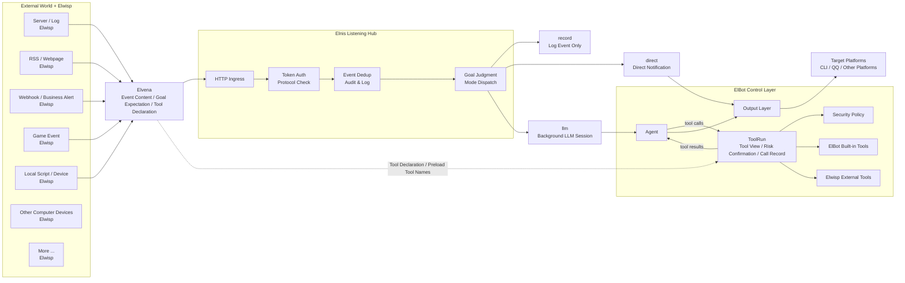

<!-- This file is auto-translated from docs/elnis.md. Do not edit manually. -->

# Elnis Listening Hub

Core Idea:

- Let ElBot control everything.
- Let Elnis manage everything.
- Let Elwisp observe everything.

Elnis is the event listening hub of ElBot. Like a star, it catches signals from the constellation of Elwisps, and ElBot then decides whether to record, notify, analyze, or execute background tasks.

## What problem does it solve

Ordinary chatbots usually only respond to user messages. Cron can respond to time, but it doesn't know what is happening in the outside world.

Elnis allows ElBot to respond to the external world.

For example:

- When a server anomaly occurs, let the LLM analyze the logs and determine whether to send a notification.
- When an RSS feed updates, automatically summarize the content and push it to the target platform.
- When a game server generates an event, let ElBot record it, send a notification, or execute background tasks.
- When a Webhook receives a business alert, pass it to ElBot first to determine the severity.
- When a local script detects a state change, send the result to ElBot instead of sending messages haphazardly.

Simply put, Elnis expands ElBot from a "bot that waits for users to speak" into an "Agent hub capable of perceiving the external world."

## Architecture Diagram



## Three Roles

### Elnis

Elnis is the event entry runtime within ElBot, assembled at the same level as the platform runtime and Cron runtime.

It uniformly receives external events and routes them to logs, notifications, or the background LLM; it is like a star around which all Elwisp signals converge, but the ultimate energy is controlled by ElBot.

Elnis is responsible for:

- Receiving Elvena event requests.
- Validating tokens and protocol fields.
- Deduplicate persistence based on `elwisp.name + source + id`.
- Record Elnis logs and audit information.
- Decide which platforms events can be delivered to.
- Execute `record`, `direct`, or `llm` according to the event mode.

Elnis is not an ordinary chat platform, nor does it implement PlatformAdapter. External events cannot bypass the Agent, Tool Runtime, Security Policy, and Output Layer.

### Elwisp

Elwisp is an external sub-listener. It can be a shell script, a resident process, an RSS poller, a Webhook forwarder, a game server plugin, a log listener, a hardware status collector, or any program that can convert external signals into HTTP JSON.

The "world" it observes is not limited by type, including but not limited to:

- Operating system events.
- File and log changes.
- Server status.
- Game or business service events.
- RSS, web pages, Webhooks.
- Database or queue messages.
- Devices, sensors, or local script outputs.
- Any content that a computer can receive, read, listen to, or generate.

Elwisp is the eyes of ElBot, acting like probes scattered across the external world. They can be numerous, small, and dispersed; they have only one responsibility: to tell Elnis what is happening in the external world.

Elwisp is only responsible for "seeing and reporting." It does not directly control ElBot, does not send messages directly to chat platforms, and does not decide whether to ultimately call an LLM or a tool.

### Elvena: event protocol

Elvena is the JSON over HTTP protocol for Elwisp to deliver events to Elnis. Hook exec within ElBot can also submit Elvena requests via the same Elvena Bus; These requests do not go through an HTTP token, but instead carry a `hook` origin, and are executed by Elnis in a unified manner for direct, LLM, and calls.

It is responsible for transforming "what happened outside" or "what the internal Hook wants to do" into a unified event that Elnis can understand: who the source is, what the event ID is, what the content is, how it should be handled, and where it should be delivered.


Initial endpoint:

```text
POST /elvena/v3/events
GET  /healthz
```

## How events are processed

After receiving an event, Elnis determines the processing method according to `mode`.

| Mode | Function | Suitable Scenarios |
| --- | --- | --- |
| `record` | Only record events, without calling the LLM or sending notifications. | Event archiving, integration testing, low-priority signals. |
| `direct` | Directly send text notifications to the target determined by Elnis. | Simple alerts, readable messages already generated by external systems. |
| `llm` | Enters a background LLM Session, where the model analyzes it to decide whether to report. | Events that require analysis, induction, judgment, or the use of tools. |

HTTP requests in `llm` mode will return quickly, and the actual processing is executed by a background worker. The LLM eventually needs to return a structured result:

```json
{
  "completed": true,
  "need_report": true,
  "report": "result"
}
```

During `need_report=true`, Elnis will send `report` according to the adjudicated target.

## View Elwisp logs

You can use `/elwisp` to view Elnis/Elwisp event logs. It reads `elnis-YYYY-MM-DD.log` and supports filtering by Elwisp name, event source, event ID, mode, and time range.

Example:

```text
/elwisp
/elwisp server-watchdog -n 20
/elwisp --source minecraft-main --mode llm --since 2h
```

## Relationship with Cron, ELyph, and Skill

| Capability | Trigger Source | Function |
| --- | --- | --- |
| Cron | Time | Execute direct or LLM tasks when the time is reached. |
| Elnis | external event | Receive events delivered by Elwisp and distribute them for processing. |
| ELyph | Task text | Describe tasks, steps, and constraints in a structured manner. |
| Skill | Reusable capabilities | Condense experience or code into discoverable and callable capabilities. |

Simply put: Cron is responsible for "when to do it", Elnis is responsible for "what happened outside", ELyph is responsible for "how the task is described", and Skill is responsible for "how capabilities are reused".

## Creating Elwisp Auxiliary Tools

In work mode, the superadmin can let ElBot use the built-in tool `elwisp_creator` to assist in creating Elwisp. This tool returns creation guides, Elvena event templates, Elnis configuration snippets, listener scaffolds, curl test commands, and security checklists; The actual writing of files or execution of commands is still handled by the file tool and shell tool.

For ready-made Elwisp examples, protocol documentation, and templates, please refer to [Elwisp Showcase](https://github.com/Elfreese/elwisp-showcase).

## Current Limitations and Future Directions

Currently, Elnis supports record, direct, and llm modes, Elwisp declaring external tools with events, multimodal message segments (text/image/file), Elvena v3 calls (raw platform APIs and the first batch of capabilities), and Hook exec delivery via the internal Elvena Bus. When a superadmin quotes and replies to an Elnis LLM report notification within the platform, it will automatically resume to the corresponding background Session to continue the conversation; When a regular user quotes it, it will only be processed as ordinary quoted text.


## Next Step: Configuration and Usage

- [Elnis Configuration and Usage](elnis-usage.md): Enable Elnis, configure Elwisp policies, send Elvena requests, and understand request fields and delivery boundaries.

