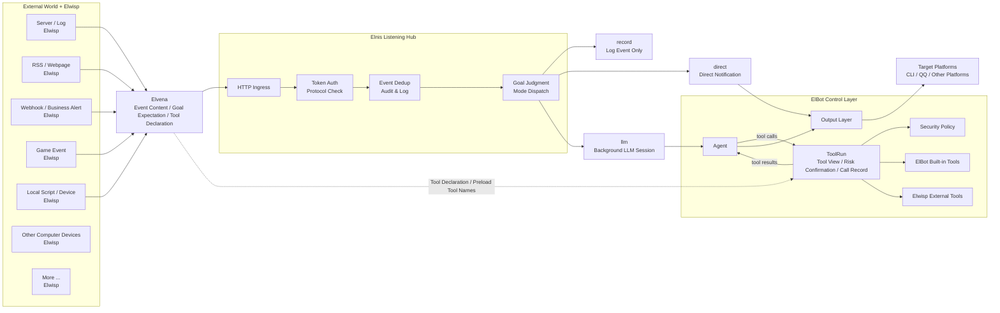

# Elnis 监听枢纽

核心思想：

- 让 ElBot 掌控一切。
- 让 Elnis 管理一切。
- 让 Elwisp 观测一切。

Elnis 是 ElBot 的事件监听枢纽。它像一颗恒星，接住来自各处 Elwisp 群星的信号，再由 ElBot 决定是否记录、通知、分析或执行后台任务。

## 它解决什么问题

普通聊天机器人通常只会响应用户消息。Cron 可以响应时间，但不知道外部世界发生了什么。

Elnis 让 ElBot 可以响应外部世界。

例如：

- 服务器异常时，让 LLM 分析日志并判断是否通知。
- RSS 更新时，自动总结内容并推送给目标平台。
- 游戏服务器产生事件时，让 ElBot 记录、通知或执行后台任务。
- Webhook 收到业务告警时，先交给 ElBot 判断严重程度。
- 本地脚本发现状态变化时，把结果送入 ElBot，而不是直接乱发消息。

简单说，Elnis 把 ElBot 从“等用户说话的机器人”扩展成“能感知外部世界的 Agent 枢纽”。

## 架构图



## 三个角色

### Elnis（艾露妮斯）

Elnis 是 ElBot 内部的事件入口 runtime，和平台 runtime、Cron runtime 同级装配。

它统一接收外部事件，把事件接到记录、通知或后台 LLM；它像一颗恒星，所有 Elwisp 的信号都围绕它汇聚，但最终能量由 ElBot 控制。

Elnis 负责：

- 接收 Elvena 事件请求。
- 校验 token 和协议字段。
- 按 `elwisp.name + source + id` 持久化去重。
- 记录 Elnis 日志和审计信息。
- 裁决事件可以投递到哪些平台。
- 按事件模式执行 `record`、`direct` 或 `llm`。

Elnis 不是普通聊天平台，也不实现 PlatformAdapter。外部事件不能绕过 Agent、Tool Runtime、Security Policy 和 Output Layer。

### Elwisp（艾露维丝）

Elwisp 是外部子监听器。它可以是一个 shell 脚本、一个常驻进程、一个 RSS 轮询器、一个 Webhook 转发器、一个游戏服务器插件、一个日志监听器、一个硬件状态采集器，或者任何能把外部信号转换成 HTTP JSON 的程序。

它观察的“世界”不限定类型，包括但不限于：

- 操作系统事件。
- 文件和日志变化。
- 服务器状态。
- 游戏或业务服务事件。
- RSS、网页、Webhook。
- 数据库或队列消息。
- 设备、传感器或本地脚本输出。
- 任何计算机能接收、读取、监听或生成的内容。

Elwisp 是 ElBot 的眼睛，也像散布在外部世界的探机。它们可以很多、很小、很分散；职责只有一个：把外部世界发生了什么告诉 Elnis。

Elwisp 只负责“看见并上报”。它不直接控制 ElBot，不直接向聊天平台发消息，也不决定最终是否调用 LLM 或工具。

### Elvena（艾露维娜）：事件协议

Elvena 是 Elwisp 向 Elnis 投递事件的 JSON over HTTP 协议。ElBot 内部的 Hook exec 也可以通过同一 Elvena Bus 提交 Elvena 请求；这类请求不经过 HTTP token，而是带 `hook` origin，由 Elnis 统一执行 direct、LLM 和 calls。

它负责把“外面发生了什么”或“内部 Hook 想做什么”变成 Elnis 能理解的统一事件：来源是谁、事件 ID 是什么、内容是什么、希望怎么处理、希望投递到哪里。


首期 endpoint：

```text
POST /elvena/v3/events
GET  /healthz
```

## 事件会怎样被处理

Elnis 收到事件后，会按 `mode` 决定处理方式。

| 模式 | 作用 | 适合场景 |
| --- | --- | --- |
| `record` | 只记录事件，不调用 LLM，不发送通知。 | 事件归档、接入测试、低优先级信号。 |
| `direct` | 按 Elnis 裁决后的目标直接发送文本通知。 | 简单告警、外部系统已生成可读消息。 |
| `llm` | 进入后台 LLM Session，由模型分析后决定是否报告。 | 需要分析、归纳、判断或使用工具的事件。 |

`llm` 模式的 HTTP 请求会快速返回，实际处理由后台 worker 执行。LLM 最终需要返回结构化结果：

```json
{
  "completed": true,
  "need_report": true,
  "report": "result"
}
```

`need_report=true` 时，Elnis 会按裁决后的目标发送 `report`。

## 查看 Elwisp 日志

可以用 `/elwisp` 查看 Elnis/Elwisp 事件日志。它读取 `elnis-YYYY-MM-DD.log`，支持按 Elwisp 名称、事件来源、事件 ID、模式和时间范围过滤。

示例：

```text
/elwisp
/elwisp server-watchdog -n 20
/elwisp --source minecraft-main --mode llm --since 2h
```

## 与 Cron、ELyph 和 Skill 的关系

| 能力 | 触发来源 | 作用 |
| --- | --- | --- |
| Cron | 时间 | 到点执行 direct 或 LLM 任务。 |
| Elnis | 外部事件 | 接收 Elwisp 投递的事件并分发处理。 |
| ELyph | 任务文本 | 用结构化方式描述任务、步骤和约束。 |
| Skill | 可复用能力 | 把经验或代码沉淀成可被发现和调用的能力。 |

简单说：Cron 负责“什么时候做”，Elnis 负责“外面发生了什么”，ELyph 负责“任务怎么描述”，Skill 负责“能力怎么复用”。

## 创建 Elwisp 辅助工具

工作模式下，超级管理员可以让 ElBot 使用内置工具 `elwisp_creator` 辅助创建 Elwisp。该工具会返回创建指南、Elvena 事件模板、Elnis 配置片段、监听器脚手架、curl 测试命令和安全检查清单；真正写文件或运行命令仍由文件工具和 shell 工具处理。

如需参考现成的 Elwisp 示例、协议文档和模板，可查看 [Elwisp Showcase](https://github.com/Elfreese/elwisp-showcase)。

## 当前限制与后续方向

当前 Elnis 已支持 record、direct、llm 模式、Elwisp 随事件声明外部工具、多模态消息段（text/image/file）、Elvena v3 calls（raw 平台 API 与首批 capability）以及 Hook exec 经内部 Elvena Bus 投递。超级管理员在平台里引用回复 Elnis LLM 报告通知时，会自动 resume 到对应后台 Session 继续对话；普通用户引用时只会作为普通引用文本处理。


以下能力仍在开发或规划中：

- Elnis 与 Elwisp 多轮通信。
- 更多统一 capability：`member.kick`、`message.pin`、`member.unmute`、bot profile/avatar/name/commands 等。
- QQ Official raw API caller。
- stdio、pipe 等非 HTTP transport。


## 下一步：配置与使用

- [Elnis 配置与使用](elnis-usage.md)：启用 Elnis、配置 Elwisp 策略、发送 Elvena 请求，并了解请求字段和投递边界。

